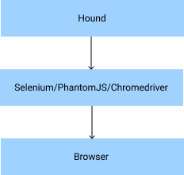
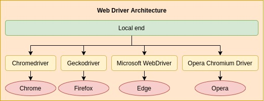
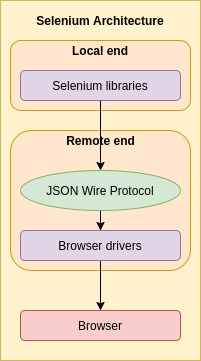

## What is Hound?

> For browser automation and writing integration tests in Elixir

Let's inspect this definition a little closer...

### What is browser automation?

Browser automation is effectively the process of using a **proxy** (like Selenium or Hound) to perform browser actions on behalf of the user (like the test case). Essentially, we are **automating the usage of the browser.**

It is often associated with illegal applications like sneaker-botting but much like [torrenting](https://www.makeuseof.com/tag/8-legal-uses-for-bittorrent-youd-be-surprised/), there are positive applications and we will be exploring one of them in this post - integration testing.

### What is integration testing?

When building software, we first build individual components to support given functional requirements. These individual components can be tested using unit tests - which ensure that given a set of inputs, the component returns a **predictable** set of outputs (predictable means that the functions tested are pure).

However, while components may work well on their own, when combined with other components (to form larger components/whole systems), unexpected behavior may be exhibited. For instance, the input from component A is transformed before it is used as input to component B, thus, the combined components returns an unexpected result.

Hence, integration tests serve to **bridge the gap between individual components testing and full system testing.**

When combined with browser automation, we can ensure that a website works end-to-end. We can ensure that the data validation on the front-end works as intended and that the forms submitted by users are properly sent to the back-end and saved in the database.

### Approaching browser automation integration testing...

We can take two approaches to browser automation integration testing. We could either

1. build our own interfacing system to communicate with the browser, or
2. rely on existing interfacing systems

The former is time-consuming and requires a lot of care during development as we have to account for varying browser APIs and quirks. Thus, it is wiser to chose the latter when approaching browser automation integration testing. Doing so minimizes the number of components we have to manage. 

### Introducing Hound!

This is where Hound comes into the picture. Hound provides a clean API to build browser automation tests. It relies on [Selenium](http://selenium.dev), [PhantomJS](https://phantomjs.org/), and [ChromeDriver](https://chromedriver.chromium.org/) as the interfacing systems to perform the "dirty" work of coordinating requests/responses to/from the browser. 



This introduces a larger question, what exactly is Selenium, PhantomJS, and ChromeDriver? More importantly, in fact,

> "How is browser automation performed?"

Understanding how browser automation is performed provides us with a better foundation to grasp how these technologies work and how Hound works under the hood.

## The world of web drivers...

The key driving (pun intended) of browser automation is web drivers. But before we can understand what they are, we should establish some basic understanding of what a driver is in general computing terms.

### What are drivers?

Drivers are pieces of software that behave as a proxy between **a caller** and **a target.** Callers can be something like the print prompt in Google Chrome or a computer peripheral. Targets can be something like the printer or computer.

In general, drivers are responsible for translating the caller's request into a given format that the target can understand.

There may be variations of a caller to the same target so each driver must be able to translate their respective caller's request into a common request format for the target. For instance, there are multiple types of keyboards that can be connected to a single computer but the computer can only understand a single request format. So the respective keyboard drivers are responsible for converting the unique keyboard's requests into the format that the computer accepts.

### Back to web drivers

Similar to general drivers, web drivers behave as proxies for the caller (Hound) to communicate with the target (browser). It allows the **caller to send instructions for the browser to perform.** In the web development world, a browser is also referred to as a **user agent.**

The Selenium project proposed a W3C specification to guide the development of web drivers. For the rest of this discussion, we will be relying on this specification. The specification can be found [here.](https://w3c.github.io/webdriver)

According to the specification, there must exist a separation of concern when designing a web driver. More specifically, there are two components to a web driver:

1. **Local end** - API for developers to send requests to the browser (libraries like Selenium and Hound)
2. **Remote end** - responsible for communicating with the browser, i.e. a browser driver (can you infer what this means?)

In essence, a web driver is comprised of an API and a browser driver. Ideally, the API should be able to work with different browser drivers for different browsers.



> The remote end must also provide an **HTTP compliant wire protocol** where each endpoint maps to a command for the browser.

This means that the remote end **relies on HTTP to communicate requests with the browser.** The remote end is a HTTP server that the local end writes HTTP requests to. The remote end translates each HTTP request (based on endpoint and method) to a command for the browser. Note that a wire protocol is a method of getting data from one point to another. It dictates that requests should follow a given format.

The specification also provides an outline for the endpoints that the remote end must make available for the local end. This ensures standardization and ease of adoption for future browser drivers.

One advantage to using a HTTP server for the remote end is that it is possible to host the remote end on a remote machine. This means that we can delegate the job of integration testing to another machine, a process commonly known as **distributed testing.** By enabling distributed testing, the local machine is not burdened with the responsibility of testing potentially extensive and rigorous integration tests which the machine may not support.

## So, how does Selenium work?

Selenium implements the web driver specification (they did author it). The remote end uses the [JSON Wire Protocol](https://github.com/SeleniumHQ/selenium/wiki/JsonWireProtocol) as the HTTP compliant wire protocol to communicate with the browser driver. Note that the documentation provided by Selenium (for the JSON Wire Protocol) has been obsoleted in favor of the one defined in the specification.



### How does Selenium differ from PhantomJS?

PhantomJS is a **headless browser** library. Headless browsers are essentially web browsers without the graphical interfaces. Selenium, on the other hand, is a web driver. The key difference between the two is the way requests are routed and managed (PhantomJS is a rather interesting project so Open-source Deep Dive: PhantomJS edition maybe?). 

However, Selenium supports headless browsers as well and more importantly, Selenium is still in active development while PhantomJS has been archived due to a lack of active contributions.

### What is ChromeDriver then?

ChromeDriver is a browser driver developed as part of the Chromium project. It is used by Selenium as one of the supported browser drivers. However, Hound supports raw requests to ChromeDriver as the underlying HTTP server works the same with or without the use of Selenium. It is an interesting project so I may explore it in another installment of Open-source Deep Dive!

## Hound: Under the hood

### Leveraging browser drivers

With a better understanding of how browser automation and web drivers work, we can in fact see that Hound doesn't rely on the entirety of Selenium (including the local end APIs). Instead, it relies on the remote end of the Selenium web driver (along with PhantomJS and ChromeDriver) to minimize the number of "moving components" that need to be managed while reaping the benefits of the existing technologies. Thus, it can focus on delivering a seamless API for developing browser automation integration tests.

### Exploring a basic use case

We will inspect a basic use case of Hound before diving into how Hound works.

```elixir
defmodule HoundTest do
	use ExUnit.Case
	use Hound.Helpers
	
	hound_session()
	
	test "the truth", meta do
		navigate_to("https://google.com")
		element = find_element(:class, "search")
		fill_field(element, "Apples")
		submit_element(element)
		
		assert page_title() == "Apples"
	end
end
```

There is quite a bit to unpack here. Let's first understand the core of how a test suite with Hound is setup.

First, we `use ExUnit.Case` as Hound works hand in hand with `ExUnit`, a built-in Elixir library for developing unit tests. It relies on two components of `ExUnit`: `setup` and `on_exit`. This allows Hound to work as expected.

Then, we `use Hound.Helpers` which, with the power of macros, imports all helper functions that are required to access the browser session.

Finally, we call `hound_session()` which creates a new session (an instance of the browser) and initializes the setup and tear down functionality of a Hound browser automation test.

Once the core of the browser automation test is built, we can write test cases as per normal, leveraging on functions like `navigate_to()` and `fill_field()` to perform browser actions. The intended behavior of these functions are easy to understand and the documentation for them can be found [here.](https://hexdocs.pm/hound/readme.html#helpers)

### Breaking it down

With a basic understanding of how a test suite can be setup in Hound, we can start to decompose Hound to better understand what makes it tick.

First, we need to inspect the following file: `lib/hound/helpers.ex` which houses the `Hound.Helpers` module, the same one that we `use` in the example above.

By overriding the `__using__` macro, Hound is able to import all of the helper functions into a given file with a single `use` statement. This helps to minimize the boilerplate for users to get started. Macros are meta programming constructs that inject code during compile-time. More on macros [here.](https://elixir-lang.org/getting-started/meta/macros.html)

```elixir
defmacro __using__([]) do
  quote do
    import Hound
    import Hound.Helpers.Cookie
    import Hound.Helpers.Dialog
    import Hound.Helpers.Element
    import Hound.Helpers.Navigation
    import Hound.Helpers.Orientation
    import Hound.Helpers.Page
    import Hound.Helpers.Screenshot
    import Hound.Helpers.SavePage
    import Hound.Helpers.ScriptExecution
    import Hound.Helpers.Session
    import Hound.Helpers.Window
    import Hound.Helpers.Log
    import Hound.Helpers.Mouse
    import Hound.Matchers
    import unquote(__MODULE__)
  end
end
```

`Hound.Helpers` also defines the `hound_session()` function which relies on `setup` and `on_exit()` of `ExUnit` to setup and tear down a session between every test case.

```elixir
defmacro hound_session(opts \\ []) do
  quote do
    setup do
      Hound.start_session(unquote(opts))
      parent = self()
      on_exit(fn -> Hound.end_session(parent) end)

      :ok
    end
  end
end
```

Each helper function constructs a HTTP request to the browser driver server using `Hackney` . For instance, `navigate_to` - which opens a given URL in the session - creates the following HTTP request:

```elixir
def navigate_to(url, retries \\ 0) do
  final_url = generate_final_url(url)
  session_id = Hound.current_session_id
  make_req(:post, "session/#{session_id}/url", %{url: final_url}, %{}, retries)
end
```

Hound rolls its own HTTP request/response management system that supports multiple retries. This can be found in the `lib/hound/request_utils.ex` file.

We have managed to break down the core functionality of Hound. There are additional interesting components to Hound that I would like to explore as well.

### Processes

Applications are started according to standard OTP specification ([here](https://elixir-lang.org/getting-started/mix-otp/supervisor-and-application.html)). `lib/hound.ex` starts a link to `Hound.Supervisor` which initializes two workers: `Hound.ConnectionServer` and `Hound.SessionServer`. These are child processes (Hound isn't fully up-to-date with Application convention) that the supervisor manages.

```elixir
def init([options]) do
  children = [
    worker(Hound.ConnectionServer, [options]),
    worker(Hound.SessionServer, [])
  ]

  supervise(children, strategy: :one_for_one)
end
```

Let's explore what the connection server and session server are all about next.

More information on processes in Elixir [here.](https://elixir-lang.org/getting-started/processes.html)

### Connection server

This process is responsible for managing the details of the browser driver and providing information to construct the HTTP server endpoints. It stores the driver information using `Agent` to allow the information to be accessed across processes.

More information on `Agent` [here.](https://hexdocs.pm/elixir/Agent.html)

### Session management

Sessions, as mentioned earlier, refer to instances of the browser that we want to run our tests on. As Hound supports multiple sessions across different processes, it has rolled a session management system.

Session management in Hound relies on `ETS`, a built-in storage option provided by Erlang and available in Elixir. When the session server first starts, it creates a new `ETS` table to hold the session information. This server is setup as a `GenServer` which allows it to support asynchronous and synchronous callbacks from other processes. 

```elixir
def init(state) do
  :ets.new(@name, [:set, :named_table, :protected, read_concurrency: true])
  {:ok, state}
end
```

When a session is first created by `hound_session()`, the current process's ID (by default, it's the main process) is related to the session. The process is monitored and the new session is created. Under the process ID, multiple sessions can be created, thus allowing Hound to support multi-session testing. Each session is identified by an ID. Each session is also assigned a name. By default, we use the session name of `:default`.  The `ETS` table holds the following information (mapped to JSON for illustration purposes. In reality, `ETS` tables store tuples of data so the actual data stored does not include any keys, just the values in the given order):

```json
[
	{
		// Process ID
		"pid": ...,
		// Process monitoring ref
		"ref": ...,
		"session_id": ...,
		// Map containing all sessions running
		"session": {
			"<session_name>": "<session_id>",
			...
		},
	}
]
```

As you can see, a session name can be assigned to the same session ID, but not the other way around (I am not too sure why this is setup as such, more investigation would be required). 

With the `ETS` table setup to manage session information, we can avoid a major problem: passing around the session ID to various functions. If we had done so, we would have increased the overhead required when using the session ID as functions would have to be designed to accept the session ID and we would have to devise a method of passing the session ID around.

Instead, the session ID is retrieved from the server on demand using the `current_session_id()` function in `lib/hound.ex`. 

As the current session ID is related to the calling process ID, multiple processes can have different sessions, thus, providing multi-session testing support. This also means that if the calling process changes, the associated session will be retrieved or a new session will be created dynamically.

If a process dies - i.e. `Process.monitor()` sends a `DOWN` message - the session server will destroy all associated sessions with that process asynchronously.

```elixir
def handle_info({:DOWN, ref, _, _, _}, state) do
  if pid = state[ref] do
    destroy_sessions(pid)
  end
  {:noreply, state}
end
```

### Configurations

Configurations are managed using Elixir's `Config` API which uses keyword parameter lists to manage configurations.

```elixir
import Config

config :hound,
  browser: "firefox"
```

The configurations are stored as application environment variables which are retrieved by the connection server.

```elixir
driver = options[:driver] || Application.get_env(:hound, :driver, "selenium")
```

More information on the `Config` API [here.](https://hexdocs.pm/elixir/master/Config.html)

### Coding conventions

Other rather interesting bits of Elixir convention that Hound employs are:

1. `^` (pin) operator

    The pin operator ensures that a variable, when matched during assignment, is the same as the existing variable of the given name

    In Hound, this is used to ensure that the retrieved process ID of session (from the session server) is the same as the given process ID (from argument).

    If the retrieved `pid` does not match the `pid` argument, an error is raised.

    ```elixir
    def all_sessions_for_pid(pid) do
      case :ets.lookup(@name, pid) do
        [{^pid, _ref, _session_id, all_sessions}] -> all_sessions
        [] -> %{}
      end
    end
    ```

    More information on the pin operator [here.](https://medium.com/@Julien_Corb/understand-the-pin-operator-in-elixir-a6f534d865a6)

2. `defdelegate`

    `defdelegate` dictates that a function's underlying behavior is deferred to that of another function in another module. 

    This allows a module to house the functionality of different modules without breaking the modularity afforded by the module system.

    Interestingly, the `__using__` override in `Hound.Helpers` can be replaced with a multitude of `defdelegate` to the helper functions but it would, understandably, create a lot of confusion.

    More information on `defdelegate` [here.](https://hexdocs.pm/elixir/Kernel.html#defdelegate/2)

3. `=` (match operator) in function parameters

    As `=` is the match operator in Elixir, it can be used to perform pattern matching while assigning the matched pattern to a variable name.

    This is very useful when working with structures as you may not want to deconstruct the entire structure while ensuring that arguments follow the given structure.

    ```elixir
    def foo(%User{} = user) do
    	IO.puts user[:name]
    end
    ```

    More information on the match operator [here.](https://elixir-lang.org/getting-started/pattern-matching.html)

4. Pattern matching as enums

    Pattern matching with atoms can be used as substitutes for typical enum behavior.

    An enum in Kotlin may look like:

    ```kotlin
    enum class MatchClause(val name: String) {
    	CLASS("class"),
    	CSS("css selector"),
    	NAME("name"),
    	ID("id"),
    	ELEM("element")
    }
    ```

    In Elixir, it can be written as such:

    ```elixir
    def match(:class), do: "class"
    def match(:css), do: "css selector"
    def match(:name), do: "name"
    def match(:id), do: "id"
    def match(:elem), do: "element"
    ```

## Conclusion

To conclude, Hound is a browser automation and integration testing library built on top of web driver - more specifically, browser driver - technologies as it leverages Selenium, PhantomJS, and ChromeDriver to build a highly abstracted and simple to use API for building integration tests. 

Under the hood, Hound is an intriguing project that uses fundamental constructs to build powerful internal libraries that support complex operations.

If you are interested in the topics discussed in this post, here are some additional readings:

1. [What is a web driver in Selenium?](https://www.tutorialspoint.com/what-is-web-driver-in-selenium)
2. [W3C WebDriver Specification](https://w3c.github.io/webdriver/)
3. [Hound GitHub repository](https://github.com/HashNuke/hound)
4. [Hackney GitHub repository](https://github.com/benoitc/hackney)
5. [Distributed testing](https://support.smartbear.com/testcomplete/docs/testing-with/advanced/distributed/basic-concepts.html)
6. [What is PhantomJS?](https://scotch.io/tutorials/what-is-phantomjs-and-how-is-it-used)
7. [ChromeDriver repository](https://source.chromium.org/chromium/chromium/src/+/master:chrome/test/chromedriver/)
8. [Uses of browser automation](https://www.testim.io/blog/browser-test-automation/)
9. [BitTorrent protocol](https://www.bittorrent.org/beps/bep_0003.html)
10. [ExUnit](https://hexdocs.pm/ex_unit/ExUnit.html)
11. [Application conventions in Elixir](https://elixir-lang.org/getting-started/mix-otp/supervisor-and-application.html)
12. [Process monitoring](https://hexdocs.pm/elixir/Process.html#monitor/1)
13. [ETS](https://erlang.org/doc/man/ets.html)
14. [GenServer](https://hexdocs.pm/elixir/GenServer.html)

> **NOTE:** I do not condone the use of browser automation or torrenting for illegal purposes. Any links or discussions about the mentioned subjects are purely for educational purposes and should remain as that.

---

Open-source Deep Dive is a series where I pick apart open-source projects to explain the underlying concepts that power these projects and share my findings about the project!
