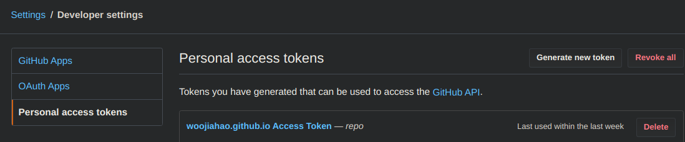

After a long hiatus induced by the demons that was school, I have finally defeated the final boss and graduated! 

With that, I have started to work on re-building my portfolio site (you're seeing it right now!). I wanted to learn [Gatsby.js](https://www.gatsbyjs.org/) and so I figured it would be the best time to do so! While working with Gatsby.js, one of the issues that I had faced was not having a proper guide on deploying Gatsby.js applications onto GitHub Pages via GitHub Actions. The official documentation does include a [guide](https://www.gatsbyjs.org/docs/how-gatsby-works-with-github-pages/) on perform [Continuous Deployment (CD)](https://www.atlassian.com/continuous-delivery/continuous-deployment) via [Travis.CI](https://travis-ci.org/) but I wanted to mess around with [GitHub Actions](https://github.com/features/actions) - GitHub's own CI/CD pipeline.

So I decided to experiment with building my own workflow and document my process. It was quite interesting how I got to the current refinement of my CD workflow and I will be sharing a little on the mistakes that I had made and the lessons learnt.

## Why Gatsby.js?

Taken directly from Gatsby's web description...

> Gatsby.js is a PWA (Progressive Web App) generator.

It may seem a little odd at first but basically, Gatsby.js is a static site generator built around React. It ties together various React plugins - like `react-router` and `webpack` - to create a seamless development experience when creating static sites.

A static site is a site where a framework is used but the library generates the resulting HTML/CSS/JS files. In doing so, the site is far more performant than dynamic sites that take time to execute the code of the framework. Gatsby.js performs all the execution when creating a bundle and we simply deploy this bundle to GitHub pages or any web hosting platform to have our site up and running. 

In a future post, I will be covering the merits of a static site generator - specifically Gatsby.js - but for now, let's move on to our next tool, **GitHub Pages!**

## Why GitHub Pages?

GitHub pages is...

> GitHub Pages is a static site hosting service that takes HTML, CSS, and JavaScript files straight from a repository on GitHub, optionally runs the files through a build process, and publishes a website.

(Definition taken from [here](https://help.github.com/en/github/working-with-github-pages/about-github-pages))

I would like to focus on these four hyper-critical words: "static site hosting service". Recall when I mentioned that Gatsby.js is a static site generator? These four words are like music to my ears! It means that once we have generated that bundle with Gatsby.js, we can use GitHub Pages to host our website! 

This is awesome because I needed a cheap (if not nothing) hosting provider to host my portfolio website. GitHub Pages will deploy the site directly from a GitHub repository, providing seamless integration and it is super userful for creating documentation sites for your projects!

A big perk to using GitHub Pages is that you can have a **user page**. This is created from a repository that follows this naming pattern: `<GitHub username>.github.io`. When using a user page, you will receive access to the `.github.io` domain. This is useful for portfolio sites as it now means that we are able to deploy our portfolio page and have a domain name like `woojiahao.github.io`! 

You can find out more about GitHub pages [here](https://help.github.com/en/github/working-with-github-pages/about-github-pages) and more about user pages [here.](https://help.github.com/en/github/working-with-github-pages/about-github-pages#types-of-github-pages-sites)

## Why GitHub Actions?

Finally, we have the star of the evening - **GitHub Actions!**

> GitHub Actions makes it easy to automate all your software workflows, now with world-class CI/CD. Build, test, and deploy your code right from GitHub.

(Definition taken from [here](https://github.com/features/actions))

GitHub Actions allows us to develop CI/CD workflows that integrates directly with GitHub. For our use case, we can use the default tier. 

I picked GitHub Actions primarily because I was intrigued by it and wanted to give it a spin. I had adopted it when working on [**torrent.go**](/projects/posts/torrent.go) (a BitTorrent protocol implementation written with Go!) and found that it was rather unique in its approach so I wanted to test it out even more.

## Chief! What is our plan of attack?

First, I would like to discuss the final strategy that I took to deploy my portfolio site to GitHub pages.

To begin, we need to outline the strict limitation of user sites...

> If the repository for your user or organization site has a master branch, your site will publish automatically from that branch. You cannot choose a different publishing source for user or organization sites.

This means that for our site, if we are using `woojiahao.github.io`, we MUST publish the site to the `master` branch.

Our CD workflow looks a little like this:

1. We push our latest changes in Gatsby.js (including new blog posts, project listings, or just site changes) to a `develop` branch

   As we may have multiple sets of changes that we push at different times, we do not want our site to be deployed immediately. Instead, we move on to step dos!
2. We will merge the changes into a `publish` branch. On merge, we should automatically deploy our application.
3. Now this is where it gets tricky, we need to build our Gatsby.js page - to create the bundle - and set the contents of this bundle to the contents of the `master` branch.

  This is where you can see our consideration of the limitation mentioned above take effect. However, by setting the `master` branch to be a "dump" for the bundle files, it would be hard for us to navigate our GitHub repository. This is why we need to properly setup our branches to allow for this peculiar workflow!

## Go, go, go!

Let's dive right into the configurations.

### Setting up branching

The first order of business is to properly setup our branching strategy. We will use a mix of both the GitHub UI and the Git CLI. So if you have not installed the Git CLI, you can do so [here.](https://git-scm.com/book/en/v2/Getting-Started-Installing-Git)

As mentioned in our workflow, we will be using three branches:

- `master` - to hold the build bundle and renders the page
- `develop` - pseudo-master branch that we will use to host our changes in Gatsby.js
- `publish` - merge-only branch that we use to trigger a deployment

So, let's first create and push the other two branches.

```bash
$ git checkout -b develop
$ git checkout -b publish
$ git push -u origin develop
$ git push origin publish
```

So we checkout the `develop` branch before the `publish` branch since we want the `publish` branch to be based on the latest changes of the `develop` branch. Don't worry, however, we will only be needing to checkout the `publish` branch via the Git CLI only once to configure.

We push and set the `develop` branch to be our [tracking branch](https://stackoverflow.com/questions/4693588/what-is-a-tracking-branch) as from now on, we want to permanently push to the remote `develop` branch.

We also push the `publish` branch to create the remote branch.

If you go to the repository in GitHub and expand the "Branch" dropdown, you should see that there will be three branches now.


Once done, we can now continue our branching configurations in the GitHub UI.

Under "Settings > Branches", there is an option for the "Default branch". Normally, it is the `master` branch. However, as mentioned earlier, we want to be able to view and access our repository easily (and have the all-so-important language colors be right!). So, we will change the default branch to be `develop`.


Once we have configured these two aspects, we are done with our branching strategy! Let's move on to the real meat of this CD - the workflow!

### Creating the workflow

GitHub Actions will look out for **workflows** in our repository to determine what actions are to be run. These workflows are stored in the `.github/workflows` folder.

We can just name our CD workflow as `deploy.yml`. Yes, these workflow files are declared as YAML documents - like Docker Compose!

```
/
|_.github/
  |_workflows/
    |_deploy.yml
```

Then, we can start to configure our workflow. Fire up your favourite text editor and let's begin!

The first thing we will configure is when this workflow will run. As mentioned earlier, we want to deploy our site only when we push to the `publish` branch via a merge, thus, we will have the following:

```yaml
on: 
  push:
    branches:
      - publish
```

Then, we can start declaring our jobs aka the thing that runs. GitHub Actions allows us to configure concurrent jobs or jobs that rely on one another, but I will not be going into detail about those in this post. If you want more information, please refer to the documentation [here.](https://help.github.com/en/actions/reference/workflow-syntax-for-github-actions#jobs) 

This workflow will only require one job and we can call it `deploy`. 

```yaml
jobs: 
  deploy:
```

We then specify what is the underlying OS the CD will use to execute this workflow.

```yaml
    runs-on: ubuntu-latest
```

Then we declare strategies. From my understanding, these are variables that we can use and we can declare them as arrays to allow us to execute the workflow on multiple versions of Node for instance.

However, in our case, we can make do with just having one version of Node since we are building once. If you require more details about strategies in GitHub Actions, refer [here.](https://help.github.com/en/actions/reference/workflow-syntax-for-github-actions#jobsjob_idstrategy)

```yaml
    strategy:
      matrix:
        node_version: [13.x]
```

Finally, we can declare our steps for the workflow.

```yaml
    steps:
```

First, checkout the repository so that our workflow can access it.

```yaml
      - name: ...
        uses: actions/checkout@v1
```

Then, we setup Node in out Ubuntu machine. We use the `node_version` we declared in our strategy.

```yaml
      - name: ...
        uses: actions/setup-node@v1
        with:
          node-version: ${{ matrix.node_version }}
```

Then, we install `gatsby-cli` and the necessary dependencies for our static site to be generated.

```yaml
      - name: ...
        run: npm install -g gatsby-cli && npm install --no-optional
```

Then, we set the Git credentials as we are using the `gh-pages` npm package to deploy our site. I will explain further later on.

```yaml
      - name: ...
        run: git config --global user.email "<insert GitHub email" && git config --global user.name "<insert desired name>"
```

Lastly, we can build the site bundle and deploy it. I have used a custom script declared in the `package.json` and a GitHub token, both of which I will be discussing below.

```yaml
      - name: ...
        run: npm run deploy
        env: GH_TOKEN: ${{ secrets.GH_TOKEN }}
```

There it is. We have created the workflow for deploying our application. However, we have some missing components that we have yet to configure so buckle up for our last set of configurations.

A sample of the whole workflow file looks like this:

```yaml
on: 
  push:
    branches:
      - publish

jobs:
  deploy:
    name: Deploy website to Github Pages with Gatsby
    runs-on: ubuntu-latest
    strategy: 
      matrix:
        node_version: [13.x]
    steps:
      - name: Checkout
        uses: actions/checkout@v1

      - name: Setup Node.js version ${{ matrix.node_version }}
        uses: actions/setup-node@v1
        with:
          node-version: ${{ matrix.node_version }}

      - name: Installing Gatsby CLI
        run: npm install -g gatsby-cli && npm install --no-optional

      - name: Setting Git credentials
        run: git config --global user.email "woojiahao1234@gmail.com" && git config --global user.name "woojiahao"

      - name: Deploy the site
        run: npm run deploy
        env: 
          GH_TOKEN: ${{ secrets.GH_TOKEN }}

```

### Creating a deploy script

We are using the `gh-pages` to automatically push the build bundle to the `master` branch. We will need to setup a `deploy` script in our `package.json` to use this package. This script will build the bundle and deploy it to the `master` branch.

```json
  "scripts": {
    ...,
    "deploy": "gatsby build && gh-pages -d public -b master -r https://$GH_TOKEN@github.com/woojiahao/woojiahao.github.io.git"
  },
```

I would like to focus in on the command for `gh-pages`.

```
gh-pages -d public -b master -r ...
```

`-d` indicates which folder the build bundle is located. In Gatsby.js case, it is the `public/` folder.

`-b` indicates which branch we will push the build bundle to. By default, it is the `gh-pages` branch. But as I have explained, we need it to be the `master` branch.

`-r` indicates the GitHub repsitory we will be pushing too. This uses the `GH_TOKEN` environment variable that we have loaded into the workflow. It also leads us nicely to the next and final configuration we need to perform - getting a GitHub access token.

### Shhh! ... (Access tokens and secrets)

The last ingredient to this workflow recipe is a GitHub access token.

We can generate a personal access token under "Settings > Developer settings > Personal access tokens > Generate new token". 



When generating the token, restrict the token's scope to `repo` only. 


You will receive a token once you create it. Copy this token to your clipboard and save it somewhere secure.

Then, go to the Gatsby.js repository and under "Settings > Secrets", select "Add a new secret". The name of the secret must be `GH_TOKEN` and the value is the copied token.


For more information about personal access tokens and GitHub secrets in GitHub Actions, you can check these links out: [access tokens](Ben2020#2762) and [secrets.](https://help.github.com/en/actions/configuring-and-managing-workflows/using-variables-and-secrets-in-a-workflow)

And we are done! This was all the configuration we needed to get the CD workflow working!

### IT WORKS!!

We can test whether the workflow works by making a merge request from `develop` to `publish`. When we accept the merge request, it will push the changes to the `publish` branch and in turn, trigger the workflow and deploy our site.

Now, just sit back and enjoy as the deployment happens automatically.

## Mistakes were made...

While experimenting with GitHub Actions, I had several "duh" moments.

### YAML disaster

When I was writing the first iteration of the workflow file, I failed to read the documentation for GitHub secrets and had incorrectly set the environment variable.

FYI, environment variables should be declared like this

```yaml
env:
  - <key>: <value>
```

and not like this

```yaml
env: ${{ secrets.GH_TOKEN }}
```

Because I had declared it improperly, I was not able to access the `GH_TOKEN` token in my workflow and it caused the workflow to fail. It took me a while to realise what I had done.

### Repository takeover!

When I was first designing my workflow, I had actually completely forgotten that there were branches outside of `developer` and `master`. Originally, I had created a completely separate repository to house my development code. This left the original repository to be a hosting platform for the build bundle.

It took me a while to realise how impractical and unnecessary this was and I re-designed the workflow.

## Conclusion

Overall, this was an interesting journey! I learnt a fair bit about Gatsby.js and GitHub Actions along the way. If you wish to view the Gatsby.js project I use for my portfolio site, you can visit it [here](https://github.com/woojiahao/woojiahao.github.io)

