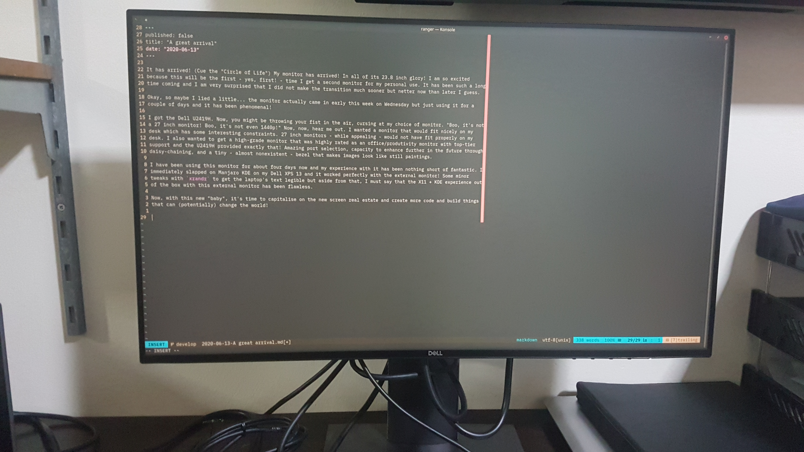

It has arrived! (Cue the "Circle of Life") My monitor has arrived! In all of its 23.8 inch glory! I am so excited 
because this will be the first - yes, first! - time I get a second monitor for my personal use. It has been such a long
time coming and I am very surprised that I did not make the transition much sooner but better now than later I guess.

Okay, so maybe I lied a little... the monitor actually came in early this week on Wednesday but just using it for a 
couple of days and it has been phenomenal!

I got the Dell U2419H. Now, you might be throwing your fist in the air, cursing at my choice of monitor. "Boo, it's not
a 27 inch monitor! Boo, it's not even 1440p!" Now, now, hear me out. I wanted a monitor that would fit nicely on my 
desk which has some interesting constraints. 27 inch monitors - while appealing - would not have fit properly on my
desk. I also wanted to get a high-grade monitor that was highly rated as an office/produtivity monitor with top-tier 
support and the U2419H provided exactly that! Amazing port selection, capacity to enhance further in the future through
daisy-chaining, and a tiny - almost nonexistent - bezel that makes images look like still paintings.

I have been using this monitor for about four days now and my experience with it has been nothing short of fantastic. I
immediately slapped on Manjaro KDE on my Dell XPS 13 and it worked perfectly with the external monitor! Some minor 
tweaks with `xrandr` to get the laptop's text legible but aside from that, I must say that the X11 + KDE experience out
of the box with this external monitor has been flawless.

Now, with this new "baby", it's time to capitalise on the new screen real estate and create more code and build things
that can (potentially) change the world!

