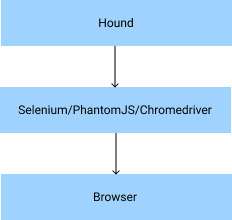

## What is Hound?

> For browser automation and writing integration tests in Elixir

### What is browser automation?

Browser automation is [defined as](https://www.testim.io/blog/browser-test-automation/) the process of automating the usage of a browser. It is often associated with bad things like sneaker botting and web scraping that are against a site's terms of service. However, much like the BitTorrent protocol, browser automation has many useful and **legal** applications in the space of software engineering and in particular: integration testing.

### What is integration testing?

According to Wikipedia, integration testing "is the phase in software testing in which individual software modules are combined and tested in a group". Essentially, a piece of software like a website is composed of various components which can be individually tested using unit tests. These components will then be tested together using integration testing to ensure that they meet the functional requirements.

When building websites, integration testing is used to ensure that the buttons of a page navigate to the appropriate page or that the form validation is working as intended. It can also ensure that forms are submitting user data to the API correctly and that the API is storing this data in the database accordingly.

While it is possible to perform these tests manually using a documented test suite, it can be time-consuming and inefficient. As such, we employ browser automation tools like Selenium.

### How does Hound work?

To communicate with the browser, we can either roll our own system that communicates with all browsers or we can rely on existing tools that already handle the communication across browsers. The problem with building our own version of the browser communication layer is that we have to accomodate for every quirk that each major (Firefox, Chrome, Safari, IE) has. Hound takes the logical approach and decides to use existing browser communication layers that come in the form of [Selenium](https://www.selenium.dev/), [PhantomJS](https://phantomjs.org/), and [Chromedriver.](https://chromedriver.chromium.org/)

Hound provides us with a clean API to make abstracted calls to the browser to control behavior and perform user interactions. We leverage this API to build automation test suites.

As such, Hound has the following general architecture:

As such, a big portion of understanding Hound is understanding how the browser communication layers - like Selenium - work. To frame this into a much broader question, we ask ourselves, 

> "How can we interact with a browser remotely (i.e. through software) where we can perform actions like button presses and filling input fields?"

Answering this question grants us a better understanding of what browser automation is about, how it is performed, how browser communication layers perform browser automation, and how Hound leverages these layers to create automation test suties.

## Introducing web drivers

The key driving force behind browser communication layers is the idea of a web driver. 

### What are drivers, generally speaking?

In computing, a [driver](https://en.wikipedia.org/wiki/Driver_(software)) is software that provides a programming interface to control and manage specific lower level interface that is often linked to a specific type of hardware, or other low-level service.

Drivers exist everywhere. When you print a document from your computer, you are using a printer driver to communicate with your printer. It parses the print request from your computer into a format that the printer is able to understand and sends it to the printer to execute. When you plug your keyboard into your computer, it uses a device driver to send inputs to the computer.

Both use cases outline the core idea of a driver: to be a proxy for the hardware/software (computer/keyboard) to access the hardware/software (printer/computer). The key duty that a driver must accomplish is to convert the request into a format the is understood by the target; different keyboards may have different hardware components and output different requests but their respective device drivers must be able to convert these requests into a standard format that the computer is able to recognise.

Broadly speaking, a driver has two components: an API and a functional component. The API serves as a means to allow the user (computer/device/program) to send requests to the target. This means that the API is often easy for the developers to access so that they can write software that leverages on the driver. The functional component is responsible for receiving the requests and processing it so that it is sent to the target in a format that the target can understand. The functional component is where most of the heavily lifting can be found.

The API largely remains the same as it is client-facing and should be as easy to pick up and use, even if the underlying functional component changes. This is a concept echoed in object-oriented programming - abstraction.

In many ways, a driver is built similarly to a REST API. The HTTP methods and URLs serve as a way for developers to access the API while the server hosting the API performs the heavy lifting (functional component).

### Back to web drivers...

Web drivers are no different. Web drivers act as a proxy for programs to interact with browsers. Due to differences in browsers, like browser engine, each browser may have a slightly different low-level interface to interact with the browser. Note that I use the term "low-level interface" to represent the interface that allows us to control the browser directly. 

As there are several browsers available for automation testing, the project team behind Selenium came up with a W3C specification for web drivers that can be found [here.](https://www.w3.org/TR/webdriver/) This is to ensure that if a major browser wishes to roll out their own web driver, they all provide a similar API for developers to access. According to the specification document, they refer to the API of the web driver as the `local end` and the functional component as the `remote end`.

### Digging deeper

Now that we have established a baseline of knowledge about what web drivers are and how they work in general, let's dive deeper and try ot understand how 

--- 

Open-source Deep Dive is a series where I pick apart open-source projects to explain the underlying concepts and share my findings about the project!

I am starting Open-source Deep Dive as a series where I pick apart an open-source project and try to learn about the underlying concepts behind it. These posts will be written in a slightly more formal and technical writing style, as opposed to my normal sharings as I want it to be as informative and straight-forward as possible.

I am starting this series in the hopes that through the various explorations, I will gain inspiration for new projects, learn about design patterns used by other developers of a language, discover new syntax and libraries, broaden my understanding of how various technologies work, get better at reading and navigating codebases, and to contribute to any issues found on the repository, if any. More importantly, I hope to just be more involved in the open-source community and hope that even if I am not able to tackle the pressing issues, someone else might discover these posts and be able to learn about the project without having to perform all the deep analysis just to get a grasp on how the project works fundamentally! 

To start out this series, I've chosen to explore a project written with Elixir - a language I've recently started using!