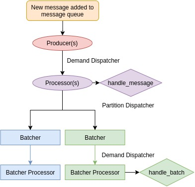
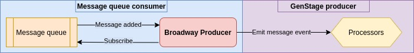

This open-source deep dive has been split into two parts! The first part covers the prerequisite knowledge that would be good to know when trying to understand the inner workings of Broadway. The second part is an in-depth analysis of the implementation of various features of Broadway.

This is the first part of the deep dive and the following topics will be covered:

1. A brief introduction to what Broadway is
2. Message queues
3. Concurrency in Elixir
4. Producer/consumer model & GenStage
5. Architecture of a Broadway pipeline
6. Construction of producer & processor components

If you wish to jump right into the meat of Broadway, you can find the second part [here!](open-source-deep-dive-broadway-part-2).

# **Act 1, Scene 1**

*You have just received your latest feature to work on and it is to build a system that receives transaction information from a message queue, maps the customer code in this transaction information to the customer's information, and stores this collective information in a separate database to be queried for customer transaction analysis. Your boss has developed an obsession with Elixir recently and is now pushing for every project to use it. Gasp.*

You start researching for libraries that can do exactly that and stumble upon [Broadway](https://github.com/dashbitco/broadway).

> ...build **[concurrent]** and **[multi-stage]** **[data ingestion]** and **[data processing] [pipelines]**...

Oh boy... that — that is a mouthful... Let's break it down, shall we?

1. **concurrent** - having two or more computations in progress at the same time; *in progress* meaning that they do not have to be executed at the same time (definition [here](https://www.oreilly.com/library/view/the-art-of/9780596802424/))
2. **multi-stage** - successive operating stages (definition [here](https://www.merriam-webster.com/dictionary/multistage))
3. **data ingestion** - process of moving data from one source to a destination for further storage and analysis (definition [here](https://www.alooma.com/blog/what-is-data-ingestion#:~:text=Data%20ingestion%20is%20a%20process,%2C%20CSVs%2C%20or%20from%20streams.))
4. **data processing** - conversion of data into a usable and desirable form (definition [here](https://planningtank.com/computer-applications/data-processing#:~:text=Data%20processing%20is%20the%20conversion,devices%2C%20and%20thus%20done%20automatically.))
5. **pipelines** - series of data processing elements (definition [here](https://en.wikipedia.org/wiki/Pipeline_(computing)#:~:text=In%20computing%2C%20a%20pipeline%2C%20also,or%20in%20time%2Dsliced%20fashion.))

In essence, Broadway builds systems that behave like factory assembly lines. Raw materials (data) is fed into the assembly line (Broadway pipeline) which is then pieced together to create the end product or other components used in the final product. The factory has multiple identical assembly lines running so raw material can be fed into any of these lines to be worked on.

For your use case, the flow of data will look something like this:


So how does Broadway achieve all of this?

# Lights! Camera! Action!

Before understanding the internals of Broadway, we should establish some basic knowledge of the technologies we will be using so that we won't be headless chickens running into this.

Broadway revolve around the following concepts:

1. message queues
2. concurrency in Elixir

## What are message queues?

**Note!** While Broadway can integrate with many types of data sources, the core examples given in the project focus on message queues as the primary data source.

> Message queues are like containers that hold sequences of work objects — called messages — that are to be consumed and processed. It aids with building asynchronous modular and concurrent systems.

Messages are created and delivered to these queues by **producers** and taken from these queues for processing by **consumers.** These messages can vary from something as simple as plain information to more complex structures like requests or — in our case — transaction information.


Message queues are useful for **decentralising the communication mechanism of large systems** by acting as a medium for exchanging events between systems which allows for systems to be easily scaled and distributed.

This is a reduced explanation of what a message queue is and what it is capable of. For more information about message queues, the [Amazon documentation](https://aws.amazon.com/message-queue/) and this [blog post](https://www.cloudamqp.com/blog/what-is-message-queuing.html#:~:text=A%20message%20queue%20is%20a,some%20headers%20at%20the%20top.) by CloudAMQP are good places to start. 

## Concurrency in Elixir

Broadway relies heavily on concurrency in Elixir. The topology (architecture) of a pipeline is built on top of processes and many of the features are achieved using the robust concurrency model of Elixir. So what exactly is the concurrency model in Elixir?

Elixir employs the **actor concurrency model**. In this model, actors are defined as **self-isolated units of processing**. In Elixir, these actors are called **processes** and they are managed by the [Erlang VM](https://en.wikipedia.org/wiki/BEAM_(Erlang_virtual_machine)#:~:text=BEAM%20is%20the%20virtual%20machine,beam%20file%20extension.). Elixir code is run in each process and a default/main process is akin to that of the [main thread](https://cocoacasts.com/swift-and-cocoa-fundamentals-what-is-the-main-thread) in other concurrency models.

Each process communicates via **asynchronous message passing**. Think of a process as a mailbox of sorts; it has a "bin" to receive incoming messages and it possess an "address" for other processes to identify it by.


The unique aspect of this model is the **lack of shared mutable state** that other concurrency models rely on. Rather, state is exclusive to each process. 

In order for the state of a process to be altered, the owner process must make the alteration either on request or internally due to certain changes.

The topic of concurrency in Elixir is vast and Elixir provides many other features surrounding its concurrency model such as [GenServer](https://elixir-lang.org/getting-started/mix-otp/genserver.html). This section is a short preview of what the actor concurrency model and concurrency in Elixir is all about. For more information, you can refer to this [thesis paper](https://berb.github.io/diploma-thesis/original/054_actors.html) and the [Wikipedia article](https://en.wikipedia.org/wiki/Actor_model#:~:text=The%20actor%20model%20in%20computer,universal%20primitive%20of%20concurrent%20computation.&text=Actors%20may%20modify%20their%20own,for%20lock%2Dbased%20synchronization) talking about the actor concurrency model and the official [documentation](https://elixir-lang.org/getting-started/processes.html) and this [tutorial](https://serokell.io/blog/elixir-otp-guide) on OTP in Elixir for more examples of concurrency in Elixir.

## Cue the producer/consumer model

Using the actor concurrency model as a foundation, another concurrency pattern can be modelled in Elixir — the producer/consumer model. 

This model aims to allow for decoupled data production and consumption by setting up two separate processes to handle each task — effectively creating a logical separation of concerns.

However, the producer/consumer model faces a critical issue — what happens if the producer generates excessive messages for the consumer? The consumer will be overwhelmed and will eventually fail trying to keep up with processing that many messages. This is where [back pressure](https://medium.com/@jayphelps/backpressure-explained-the-flow-of-data-through-software-2350b3e77ce7) comes into play.

> Back pressure is a control mechanism for how much a producer should emit based on consumer demand, consumer message buffering, or limited sampling

Back pressure avoids the problem of overloading the consumer with messages by applying one of or a combination of the three methods mentioned above (more information in the link [here](https://medium.com/@jayphelps/backpressure-explained-the-flow-of-data-through-software-2350b3e77ce7)).

## The next frontier (of concurrency): GenStage

Seeing the value of having a standard implementation for the producer/consumer model, the Elixir team decided to develop exactly that. 

> GenStage is a specification for exchanging events between producers and consumers with back pressure between Elixir processes

Producers **emit events** to consumers for **processing**. The events can be of any structure.

The control mechanism used is a demand system. Consumers inform producers of how many events they can handle (demand) and producers emits no more than the demanded amount. This ensures that the consumers are capable of handling the events emitted.

Producer-consumers behave like both producers and consumers. They are used to perform transformations on events emitted by the producer before they are emitted to the consumer.

Similar to [GenServer](https://hexdocs.pm/elixir/GenServer.html), stages in GenStage exchange events through [callbacks](https://hexdocs.pm/gen_stage/GenStage.html#module-callbacks).

When a demand is handled  — i.e. producer emits events and demanding consumer handles these events — another demand is made, creating a cycle where both stages are always working - ideally.

GenStage is a powerful tool in an Elixir developer's arsenal. More information can be found in the [official announcement](https://elixir-lang.org/blog/2016/07/14/announcing-genstage/) where a little bit of history of how GenStage came to be was discussed and in a talk by [José Valim](https://youtu.be/XPlXNUXmcgE) — creator of Elixir.

With a better grasp of the overarching concepts used in Broadway, we can finally discuss what Broadway is all about and how it does what it does!

# Pipeline architecture



It is at this juncture where it would be important to clarify the term "producer". In both message queues and GenStage, a producer is a creator of messages or events. However, in Broadway, a producer is both a consumer of messages and an emitter of events.



For the rest of the article, the following definitions for the following terminology will be used:

1. **producer** — producer of events in Broadway
2. **message** — message in a message queue or any other data source
3. **event** — GenStage events

When messages are consumed by the producer, they will be transformed into events with a fixed structure defined by Broadway. 

Each component is a separate process and they are dynamically generated as different topologies (architectures) can be designed. The order of initialisation for a typical pipeline looks something like this:


The producers and processors are both created using interesting conventions that is will be explored now. Other components will be discussed later on as they tie into other features Broadway has.

## How it's made: Producers

Producers are built using a pattern similar to the [strategy pattern](https://en.wikipedia.org/wiki/Strategy_pattern) but modified to integrate with the concurrency system in Elixir.

Different data sources require different methods of establishing connections and receiving messages. Thus, we break up the producer process into two modules — `ProducerStage` defines the behavior for enforcing the rate limit while a dynamically loaded module defines the behavior for establishing a connection to the data source and receiving messages.

`ProducerStage` assumes that the dynamically loaded module contains the typical GenStage callbacks like `handle_call` and `handle_demand` and uses them for things like rate limiting.

The `ProducerStage` behaves as the context while the dynamic module behaves as the strategy. The dynamic module adopts the `Producer` module — which defines two callbacks for managing the overall producer life-cycle.

To load the module dynamically, the module name is passed to `ProducerStage` as an argument. To keep the producer as a single process, we call the `init` function of the module directly when initialising the `ProducerStage`. This way, the module will initialise under the newly spawned process for `ProducerStage` rather than spawning an entirely new process.

```elixir
@impl true
def init({args, index}) do
  {module, arg} = args[:module]
	# ...
  state = %{
    module: module,
    module_state: nil,
    transformer: transformer,
    consumers: [],
    rate_limiting: rate_limiting_state
  }

	# Calling the init function of the dynamically loaded module
  case module.init(arg) do
		# ...
  end
end
```

When `start_link` is called, a new process is spawned first before the `init` function is called under the new process.

This is done as certain message queue providers like [RabbitMQ](https://github.com/dashbitco/broadway_rabbitmq) attach active listeners to the calling process so spawning a separate process for this would mean having to manage two separate processes for a producer.

## How it's made: Processors

Processors are created using a concept similar to [inheritance](https://en.wikipedia.org/wiki/Inheritance_(object-oriented_programming)) in object-oriented programming. This idea comes from the need to standardise the subscription logic of producer-consumers and consumers.

When a processor is started using `start_link`, a process of the `Subscriber` module is started with the current processor module passed as a argument. 

```elixir
def start_link(args, stage_options) do
  Broadway.Topology.Subscriber.start_link(
    __MODULE__,
    args[:producers],
    args,
    Keyword.take(args[:processor_config], [:min_demand, :max_demand]),
    stage_options
  )
end
```

The current module is initialised in the `Subscriber` process through `init`.

```elixir
@impl true
def init({module, names, options, subscription_options}) do
  {type, state, init_options} = module.init(options)
	
	# ...
end
```

Other producer-consumers and consumers like batcher and batch processors also use this pattern to create their respective GenStage stages. 

A separation of concern is achieved using this pattern. The processor is responsible for event handling while the subscriber handles the subscription logic.

---

That's a basic rundown of the concepts underpinning Broadway. While it may not be a complete and intensive explanation of everything, hopefully it is able to provide some clarity. In the next part, we will be exploring how features in Broadway have been implemented! 

Hop on over to the second part [here!](open-source-deep-dive-broadway-part-2)

---

Open-source Deep Dive is a series where I pick apart open-source projects to explain the underlying concepts that power these projects and share my findings about the project!