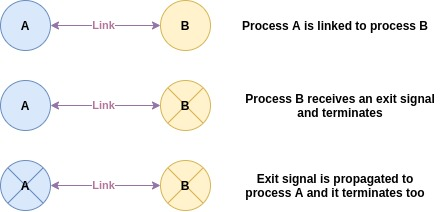

This open-source deep dive has been split into two parts! The first part covers the prerequisite knowledge that would be good to know when trying to understand the inner workings of Broadway. The second part is an in-depth analysis of the implementation of various features of Broadway.

This is the second part of the deep dive and the following topics will be covered:

1. Rate limiting
2. Batching messages
3. Telemetry
4. Creating a built-in testing suite for pipelines
5. Achieving graceful shutdowns
6. Other interesting bits of code

If you want to better understand Broadway from a bird's eye view or need a refresher on the concepts behind Broadway (like message queues and concurrency in Elixir), you can find the first part [here!](open-source-deep-dive-broadway-part-1)

# What's the scoop?

Now that we have explored the overall architecture of a Broadway pipeline, we can look at how certain features in Broadway are implemented.

## Rate limiting

> Rate limiting refers to the act of limiting the amount of data that can be requested or processed in a given period of time

Rate limiting is applied across producers within a single pipeline to control the number of events emitted within a given period of time. 

This is especially useful when the hardware of the machine running the pipeline is not able to keep up with processing large numbers of events demanded at a time — possibly due to a poorly configured pipeline.

Some producers do not leverage the rate limiting feature of Broadway. For instance, the [RabbitMQ producer](https://github.com/dashbitco/broadway/blob/master/lib/broadway/topology/producer_stage.ex) creates an active listener, which means that messages are not inhibited by the rate limiter. Instead, they are emitted as events the moment they are published to the message queue (unless [otherwise configured](https://hexdocs.pm/broadway_rabbitmq/BroadwayRabbitMQ.Producer.html#module-back-pressure-and-prefetch_count)).

But for the producers that *do* leverage the rate limiting — such as the [Amazon SQS producer](https://github.com/dashbitco/broadway_sqs/blob/master/lib/broadway_sqs/producer.ex) — rate limiting is applied in two instances:

1. When consumers make demands to the producer-consumer or producer

    If the producer can still emit events, any demand made by the consumer will be handled by the producer. We take into account the rate limit threshold. If there are too many events to emit, the excess messages are stored in a message buffer that will have to be cleared later on.

    Each message that can be emitted will be transformed into the standard event structure that Broadway uses.

    If the producer can no longer emit messages, any demand made is stored in a demand buffer that is cleared later on.

2. When the rate limit is being reset after the given interval

    After the given interval, the rate limit threshold can be reset. However, we may have accumulated demands and messages in their respective buffers. We may find that the threshold has not been met before we reset it. Thus, we can use this remaining threshold to clear any lingering demands and messages stored in their respective buffers.

    Once we have cleared as many messages as our remaining threshold allows, we will reset the threshold and schedule for another reset. These resets are scheduled at fixed intervals.

The rate limiting threshold is maintained as an [atomic](https://erlang.org/doc/man/atomics.html) (discussed later on). This atomic array is generated by the `RateLimiter` process. This module handles all behavior surrounding working with the rate limit threshold. `ProducerStage` handles the actual logic of managing the demands of consumers. 

When the producer cannot emit any more events, i.e. the threshold has been reached, an internal state is set to `:closed` to avoid future demands from being handled.

## Batching

Batching groups events based on given properties and sends them to designated "sub-pipelines" or batch processors to be handled. For instance, we might design a pipeline that stores events with even numbers in an S3 bucket and ones with odd numbers on Google Drive.

The `Batcher` process is assigned unique names for identification and events that are emitted from the producer must be tagged to a batcher. Failure to do so will result in a runtime error. This only applies if batching is enabled.

In order for the producer to send the appropriate events to the respective batcher, a `PartitionDispatcher` is used. Essentially, it defines the behavior of how events are emitted to consumers. A `PartitionDispatcher` dispatches events to certain consumers based on a given criteria (defined as a [hash function](https://en.wikipedia.org/wiki/Hash_function)). In this case, the hash function is the name of the batcher from the given event. This means that when we assign a batcher to the event, it **will** be dispatched to only that consumer. More information about dispatchers in GenStage can be found in the [official documentation](https://hexdocs.pm/gen_stage/GenStage.Dispatcher.html#summary).

Even within the batcher, further grouping can be made based on a batch key assigned to the event. This may be used to ensure that certain events are processed together. Internally, the batcher will accumulate events before emitting them. However, as it cannot sit around accumulating events forever, a batch is emitted at regular intervals regardless of how many events are stored in it.

The `BatchProcessor` process handles a single batch at a time. It is similar to a regular processor, except it works on a batch of events. The `handle_batch` callback is used here.

## Telemetry

Telemetry is used in Broadway to benchmark certain operations that occur such as the duration that a `handle_message` callback takes.

Broadway relies on the `telemetry` [library](https://hexdocs.pm/telemetry/). Within the code, events are emitted when these operations occur and key measurements such as duration are tracked. Handlers/listeners of these events can be setup to respond to these events.

Telemetry is not an Elixir-only feature. It is commonly used to perform application monitoring. [OpenTelemetry](https://opentelemetry.io/) is a really interesting framework that offers powerful application monitoring through telemetry.

## Built-in testing

To test the pipeline, we should focus on ensuring that the data processing aspect of the pipeline works as intended. However, as we rely on external services for input, it would be hard to coordinate a test suite to work with a live data source as we may not be able to replicate the data source or publish data to the data source at will due to access limitations. Thus, Broadway has designed a testing utility that allows us to test the pipeline's data processing capacity without relying on the data source.

Broadway provides a placeholder producer module. This producer does not rely on any data sources. Instead, messages are emitted directly into the pipeline.

The producer module should be tested separately if there is core behavior that cannot be tested along with the pipeline.

This form of unit testing ensures that we reduce potential points of failure in our test suite if any of the mentioned problems with using the original data source should surface.

## Graceful shutdowns

Broadway boasts about having [graceful shutdowns](https://hexdocs.pm/broadway/architecture.html#graceful-shutdowns). This is a rather interesting concept to explore as it relies heavily on the concurrency system of Elixir.

Essentially, the pipeline can only exist in two states — when all components are online and when all components are shutting down. There is no point in time where a single component will shutdown on its own without being restarted. This is because of the way that the supervisor of each component declares restart strategies ensuring that should a child process encounters any errors, it will be restarted without a hitch. This way, the only time where our components can shut down is when we shut down our main process or pipeline supervisor process. When either process is terminated, we want to properly handle all remaining events in the pipeline before shutting off every component.

This is achieved through a mix of concurrency features. But before we can explain how it works, a simple introduction of exit signals and process termination is due.

### Exit signals and process termination

Processes can be [linked](https://hexdocs.pm/elixir/Process.html#link/1) to one another. When either process receives an exit signal — which can occur when the process is terminated forcibly or when it receives an exit signal propagated from its parent — it will propagate the exit signal to the linked process and that process will terminate as well.



However, these exit signals can be [trapped](https://crypt.codemancers.com/posts/2016-01-24-understanding-exit-signals-in-erlang-slash-elixir/) instead. When this occurs, rather than terminating the process that receives the propagated exit signal, the exit signal is sent as a message, allowing the receiving process to handle the exit as though it was just another message.

```elixir
def handle_info({:EXIT, from, reason}, state) do
	# ...
end
```

When a process is terminated, an optional `terminate/2` [callback](https://hexdocs.pm/elixir/GenServer.html#c:terminate/2) can be declared to perform any cleanup before the process is actually terminated. This is useful if we have any lingering operations that should be completed before we terminate the process.

[Supervisors](https://hexdocs.pm/elixir/Supervisor.html) can start a list of child processes and is responsible for managing the restart strategy of each child. The interaction between a supervisor and `terminate` is rather interesting. When a child is terminated, it is restarted accordingly. When a supervisor terminates, all of its children will also be terminated. If a child process traps exits, the `terminate` callback is called. If not, it will simply terminate immediately without calling the callback. More information about how supervisor interact with shutdowns can be found in the official [documentation](https://hexdocs.pm/elixir/Supervisor.html#module-start-and-shutdown).

### Back to our regularly scheduled deep dive...

With a basic understanding of exit trapping and process termination, we can actually understand how graceful shutdowns in Broadway works. 

When the main process or the pipeline supervisor process is terminated, the main process — which traps exit signals — will invoke its `terminate` callback which will trap the exit signal of the `Terminator` process and terminate our pipeline supervisor. As this `Terminator` process is a child of the pipeline supervisor, it will invoke its implementation of `terminate`.

```elixir
@impl true
def terminate(reason, %{name: name, supervisor_pid: supervisor_pid, terminator: terminator}) do
  Broadway.Topology.Terminator.trap_exit(terminator)
  ref = Process.monitor(supervisor_pid)
  Process.exit(supervisor_pid, reason_to_signal(reason))

  receive do
    {:DOWN, ^ref, _, _, _} -> :persistent_term.erase(name)
  end

  :ok
end
```

The exit signal propagates to the other components through their supervisors terminating and they will also invoke their `terminate` callback if they trap exits such as disconnecting from the data source.

The `Terminator` process is responsible for ensuring that all events still within the pipeline is processed before terminating the pipeline entirely.

It does so in three phases:

1. Notify that the processors do not resubscribe to producers through a state flag
2. Drain the producers of any events remaining
3. Wait for the batch processors (which will be the very last component in the pipeline) to terminate before terminating the supervisor

```elixir
@impl true
def terminate(_, state) do
  for name <- state.first, pid = Process.whereis(name) do
    send(pid, :will_terminate)
  end

  for name <- state.producers, pid = Process.whereis(name) do
    Broadway.Topology.ProducerStage.drain(pid)
  end

  for name <- state.last, pid = Process.whereis(name) do
    ref = Process.monitor(pid)

    receive do
      {:done, ^pid} -> :ok
      {:DOWN, ^ref, _, _, _} -> :ok
    end
  end

  :ok
end
```

Interestingly, as the producer may be waiting to drain events, we may not want to cancel all of its consumers immediately. Thus, we rely on `GenStage#async_info` to [queue](https://hexdocs.pm/gen_stage/GenStage.html#async_info/2) the message to cancel all consumers at the end of the GenStage message queue — effectively waiting for all other events to be processed before cancelling all consumers. If batching is enabled, the processors will also wait for the batches to be processed before cancelling all consumers.

```elixir
@spec drain(GenServer.server()) :: :ok
def drain(producer) do
  GenStage.demand(producer, :accumulate)
  GenStage.cast(producer, {__MODULE__, :prepare_for_draining})
	# The :cancel_consumers message is added to the end of the message queue
  GenStage.async_info(producer, {__MODULE__, :cancel_consumers})
end
```

These mechanisms ensure that all events left in the pipeline is properly processed before the pipeline terminates, thus achieving graceful shutdowns.

# Fascinating discovery!

These are some interesting bits of code that Broadway has.

## `__using__` configurations

Like other libraries in Elixir, `use Broadway` is where it all begins. As discussed in the previous [open-source deep dive](https://woojiahao.github.io/blog/posts/open-source-deep-dive-hound), the behavior of `use` can be altered by defining the `__using__` macro.

```elixir
defmacro __using__(opts) do
  quote location: :keep, bind_quoted: [opts: opts, module: __CALLER__.module] do
    @behaviour Broadway

    @doc false
    def child_spec(arg) do
      default = %{
        id: unquote(module),
        start: {__MODULE__, :start_link, [arg]},
        shutdown: :infinity
      }

      Supervisor.child_spec(default, unquote(Macro.escape(opts)))
    end

    defoverridable child_spec: 1
  end
end
```

There are three interesting bits of code in the `__using__` macro:

1. `location: keep`

    Used to report runtime errors from inside the quote. Without this, errors are reported where the defined function (in `quote`) is invoked. This is to ensure that we are aware of where the errors are occurring. More information about this configuration can be found [here](https://hexdocs.pm/elixir/Kernel.SpecialForms.html#quote/2-stacktrace-information).

2. `bind_quoted`

    Used to create bindings within the quote. When a binding is created, the value is automatically [unquoted](https://elixir-lang.org/getting-started/meta/quote-and-unquote.html#unquoting) (which includes evaluation) and the value cannot be unquoted again. This is especially used when we do not want to re-evaluate the value multiple times. 

    More information quoting and unquoting in Elixir can be found in the [official tutorial](https://elixir-lang.org/getting-started/meta/quote-and-unquote.html) and a simplified explanation and example of binding can be found [here](https://elixirschool.com/en/lessons/advanced/metaprogramming/#binding).

3. `@behaviour`

    Used to define interface-like behavior where modules that adopt these behaviors can implement callbacks defined. In this case, when a module `use Broadway`, it will have to implement certain callbacks like `handle_message` while other callbacks like `handle_batch` remain optional.

    ```elixir
    @callback prepare_messages(messages :: [Message.t()], context :: term) :: [Message.t()]
    @callback handle_message(processor :: atom, message :: Message.t(), context :: term) ::
                Message.t()
    @callback handle_batch(
                batcher :: atom,
                messages :: [Message.t()],
                batch_info :: BatchInfo.t(),
                context :: term
              ) :: [Message.t()]
    @callback handle_failed(messages :: [Message.t()], context :: term) :: [Message.t()]

    @optional_callbacks prepare_messages: 2, handle_batch: 4, handle_failed: 2
    ```

    More information about typespecs can be found in the [official documentation](https://elixir-lang.org/getting-started/typespecs-and-behaviours.html#adopting-behaviours).

## Module metadata processing

While on the topic of meta-programming, module metadata can also be processed. 

`ensure_loaded?` ensures that a given module is loaded. In Broadway, this is used to ensure that the `:persistent_term` module from Erlang is available for Elixir — the only time it will not be available is when the version of Elixir is too old. Documentation [here](https://hexdocs.pm/elixir/Code.html#ensure_loaded?/1).

```elixir
unless Code.ensure_loaded?(:persistent_term) do
  require Logger
  Logger.error("Broadway requires Erlang/OTP 21.3+")
  raise "Broadway requires Erlang/OTP 21.3+"
end
```

`function_exported?` returns whether a module contains a definition for a **public** function with a given arity. Used to execute functions from modules if they are defined. Documentation [here](https://hexdocs.pm/elixir/Kernel.html#function_exported?/3).

```elixir
if Code.ensure_loaded?(producer_mod) and
     function_exported?(producer_mod, :prepare_for_start, 2) do
  case producer_mod.prepare_for_start(module, opts) do
    {child_specs, opts} when is_list(child_specs) ->
      {child_specs, NimbleOptions.validate!(opts, Broadway.Options.definition())}

    other ->
			# ...
```

## Dynamic process naming

As the pipeline can comprise of any number of components, Broadway supports dynamically generated processes. These dynamically generated processes are assigned names that follow a fixed convention — comprising of the name of the pipeline, the process type, and the index of the component among the other components of the same type.

```elixir
defp process_name(prefix, type, index) do
  :"#{name_prefix(prefix)}.#{type}_#{index}"
end

defp process_names(prefix, type, config) do
  for index <- 0..(config[:concurrency] - 1) do
    process_name(prefix, type, index)
  end
end
```

The names are returned as quoted atoms where the atom has a space in it so it has to be declared via `:""` .

## Storage options in Elixir

Besides the basic data structures like lists and dictionaries, Elixir and Erlang offer other ways of storing data within processes.

1. [Atomics](https://erlang.org/doc/man/atomics.html)

    `:atomics` are a way of performing atomic operations on a set of mutable atomic variables.

    Used to maintain the rate limiting threshold. 

    Previously, the rate limiter used [ETS](https://erlang.org/doc/man/ets.html) instead but atomic operations are much better for concurrent systems as they avoid race conditions when multiple producer processes are attempting to modify the rate limit.

    ```elixir
    counter = :atomics.new(@atomics_index, [])
    :atomics.put(counter, @atomics_index, allowed)
    ```

2. [Persistent term](https://erlang.org/doc/man/persistent_term.html)

    Storage for Erlang terms that is optimised for reading terms at the expense of writing and updating terms.

    Used to store pipeline metadata like producer names etc.

    ```elixir
    :persistent_term.put(config.name, %{
      context: config.context,
      producer_names: process_names(config.name, "Producer", config.producer_config),
      batchers_names:
        Enum.map(config.batchers_config, &process_name(config.name, "Batcher", elem(&1, 0))),
      rate_limiter_name:
        config.producer_config[:rate_limiting] && RateLimiter.rate_limiter_name(opts[:name])
    })
    ```

3. [Queue](https://erlang.org/doc/man/queue.html)

    Manage first-in, first-out queues.

    Used to manage message and demand buffers in the producer.

    ```elixir
    # A queue of "batches" of messages that we buffered.
    message_buffer: :queue.new(),
    # A queue of demands (integers) that we buffered.
    demand_buffer: :queue.new()
    ```

4. [Process dictionaries](https://hexdocs.pm/elixir/Process.html)

    Store state within a process directly although its usage is generally [frowned upon](https://elixirforum.com/t/is-it-a-good-idea-to-store-context-in-process-dictionary-registry-for-http-requests/3142). 

    Used to store batches in the batcher.

    ```elixir
    defp init_or_get_batch(batch_key, state) do
      if batch = Process.get(batch_key) do
        batch
      else
    		# ...
      end
    end

    defp put_batch(batch_key, {_, _, _} = batch) do
      Process.put(batch_key, batch)
    end
    ```

    A better alternative might have been to use an [Agent](https://hexdocs.pm/elixir/Agent.html) or ETS instead.

## Options validation

Dashbit — the team behind Broadway — developed an options validation library called [NimbleOptions](https://github.com/dashbitco/nimble_options) that aims to be a small library for validating and documenting high-level options.

A set of definitions for the available options are created first and these can be used to validate a keyword list — aka the options.

If the options are invalid, an error is returned, otherwise an `:ok` status along with the options are returned. The returned options have default values filled in.

## Default values in dictionaries

Broadway has an interesting way of fanning out default values for the options keyword list. In the options keyword list, a "parent" value for `:partition_by`, `:hibernate_after`, and `:spawn_opt` is provided.

```elixir
options = [
	partition_by: ..., # these are parent values
	hibernate_after: ...,
	producer: [
		hibernate_after: ... # this is a child value
	]
]
```

The parent value will be used for producers, processors, and batchers if no explicit child value is provided. Alternatively, we might want to fan out a parent value to only two of the three unset child values while maintaining the original child value.

This is done by [merging](https://hexdocs.pm/elixir/Keyword.html#merge/2) the child options into the parent options. Thus, if the child does not define a value for the option, the parent value is inherited.

```elixir
opts =
  opts
  |> carry_over_one(:producer, [:hibernate_after, :spawn_opt])
  |> carry_over_many(:processors, [:partition_by, :hibernate_after, :spawn_opt])
  |> carry_over_many(:batchers, [:partition_by, :hibernate_after, :spawn_opt])

defp carry_over_one(opts, key, keys) do
  update_in(opts[key], fn value -> Keyword.merge(Keyword.take(opts, keys), value) end)
end

defp carry_over_many(opts, key, keys) do
  update_in(opts[key], fn list ->
    defaults = Keyword.take(opts, keys)
    for {k, v} <- list, do: {k, Keyword.merge(defaults, v)}
  end)
end
```

# Closing the curtains

To conclude, Broadway is a powerful library for building data processing pipelines. These pipelines are built on top of the robust concurrency system that Elixir boasts.

If any topic discussed in this post has intrigued you, you can find the following additional readings:

- [ ]  Add additional readings

---

Open-source Deep Dive is a series where I pick apart open-source projects to explain the underlying concepts that power these projects and share my findings about the project!