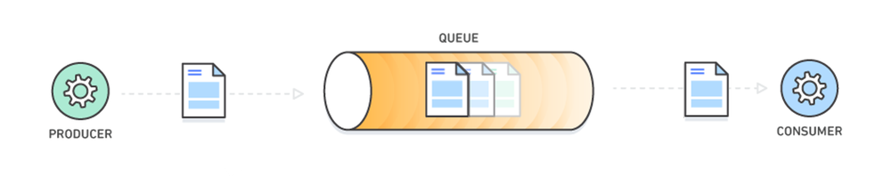
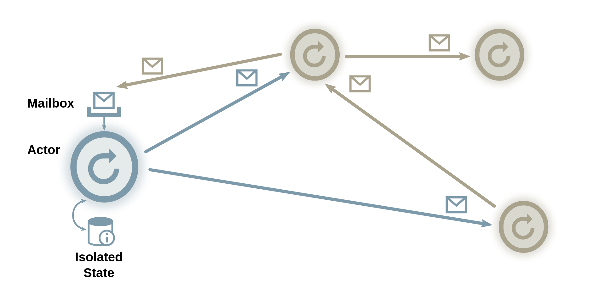
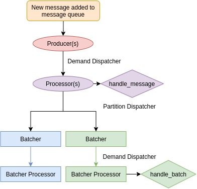
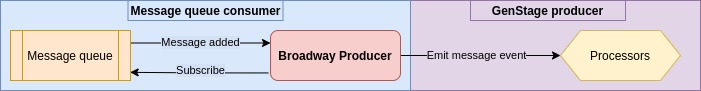
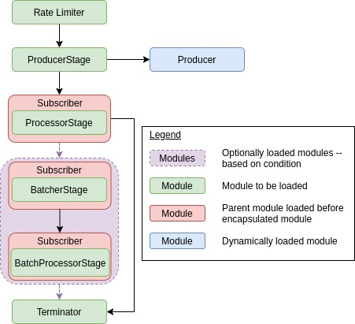

# Draft @Apr 8, 2021

---

published: true
date: "2021-04-17"
title: "Open-source Deep Dive: Broadway"
tags:

- Open-source Deep Dive
- Elixir
- Broadway
- data processing
- message queue
- message queues
- concurrency
- actor concurrency model
- producer/consumer model

description: "In this installment of Open-source Deep Dive, Broadway takes center stage! I uncover the mystery of message queues and concurrency in Elixir and demystify the intricate design behind the pipelines that Broadway creates. I also inspect how certain key features of Broadway work like rate limiting and batching! Note that this post is purely for educational purposes, the information gathered from here should only be used in the context of integration testing for websites that are directly under your ownership."

---

# **Act 1, Scene 1**

*You have just received your latest feature to work on and it is to integrate a message queue holding transaction information with a live dashboard. Your boss developed an obsession with Elixir recently and is now pushing for every project to use it. Gasp.*

You start researching for libraries that can do exactly that and stumble upon [Broadway](https://github.com/dashbitco/broadway).

> ...build **[concurrent]** and **[multi-stage]** **[data ingestion]** and **[data processing] [pipelines]**...

Oh boy... that — that is a mouthful... Let's break it down shall we?

1. **concurrent** - simultaneous
2. **multi-stage** - successive operating stages
3. **data ingestion** - process of moving data from one source to a destination for further storage and analysis (definition [here](https://www.alooma.com/blog/what-is-data-ingestion#:~:text=Data%20ingestion%20is%20a%20process,%2C%20CSVs%2C%20or%20from%20streams.))
4. **data processing** - conversion of data into usable and desirable form (definition [here](https://planningtank.com/computer-applications/data-processing#:~:text=Data%20processing%20is%20the%20conversion,devices%2C%20and%20thus%20done%20automatically.))
5. **pipelines** - series of data processing elements (definition [here](https://en.wikipedia.org/wiki/Pipeline_(computing)#:~:text=In%20computing%2C%20a%20pipeline%2C%20also,or%20in%20time%2Dsliced%20fashion.))

Putting it all together, we can say that Broadway...

> ...allows the development of systems that receive information from data sources and process this information for further use. The data processing can be performed simultaneously.

In essence, Broadway builds systems that behave like factory assembly lines. Raw materials (data) is fed into the assembly line (Broadway pipeline) which is then pieced together to create the end product.

For your use case, Broadway will sit between your message queue and live dashboard — serving as the glue that binds the two. So, how exactly does Broadway work?

# Lights! Camera! Action!

Before understanding the internals of Broadway, we should establish some basic knowledge of the technologies we will be using so that we won't be headless chickens running into this.

Broadway — and our feature — revolve around the following two concepts:

1. message queues
2. concurrency in Elixir

## What are message queues?

> Message queues are like containers that hold sequences of work objects — called messages — that are to be consumed and processed. It aids with building asynchronous modular and concurrent systems.

Messages are created and delivered to these queues by **producers** and taken from these queues for processing by **consumers.** These messages can vary from something as simple as plain information to more complex structures like requests or — in our case — transaction information.



Message queues are especially powerful for decentralising the communication mechanism of large systems. Rather than having the producers and consumers communicate with one another directly, they use message queues as a medium to exchange events which allows for systems to be more easily scaled and distributed.

This is a very reduced explanation of what a message queue is and what it is capable of. For more information about message queues, the [Amazon documentation](https://aws.amazon.com/message-queue/) and this [blog post](https://www.cloudamqp.com/blog/what-is-message-queuing.html#:~:text=A%20message%20queue%20is%20a,some%20headers%20at%20the%20top.) by CloudAMQP are good places to start. 

## Concurrency in Elixir

Broadway relies heavily on concurrency in Elixir. The topology (architecture) of a pipeline is built on top of processes and many of the features are achieved using the robust concurrency model Elixir boasts. So what exactly is the concurrency model in Elixir?

Elixir employs the **actor concurrency model**. In this model, actors are defined as **self-isolated units of processing**. In Elixir, these actors are called **processes** and they are managed by the [Erlang VM](https://en.wikipedia.org/wiki/BEAM_(Erlang_virtual_machine)#:~:text=BEAM%20is%20the%20virtual%20machine,beam%20file%20extension.). Elixir code is run in each process and a default/main process being akin to that of the [main thread](https://cocoacasts.com/swift-and-cocoa-fundamentals-what-is-the-main-thread) in other concurrency models.

Each process communicates via **asynchronous message passing**. Think of a process as a mailbox of sorts; it has a "bin" to receive incoming messages and it possess an "address" for other processes to identify to send messages to.



The unique aspect of this model is the lack of shared mutable state that other concurrency models rely on. Rather, state is exclusive to each process. 

In order for the state of a process to be altered, the owner process must make the alteration either on request by other processes or internally due to certain changes.

The topic of concurrency in Elixir is vast and Elixir provides many other features surrounding its concurrency model such as [GenServer](https://elixir-lang.org/getting-started/mix-otp/genserver.html). This section is a short preview of what the actor concurrency model and concurrency in Elixir is all about. For more information, you can refer to this [thesis paper](https://berb.github.io/diploma-thesis/original/054_actors.html) and the [Wikipedia article](https://en.wikipedia.org/wiki/Actor_model#:~:text=The%20actor%20model%20in%20computer,universal%20primitive%20of%20concurrent%20computation.&text=Actors%20may%20modify%20their%20own,for%20lock%2Dbased%20synchronization).) talking about the actor concurrency model and the official [documentation](https://elixir-lang.org/getting-started/processes.html) and this [tutorial](https://serokell.io/blog/elixir-otp-guide) on OTP in Elixir for more examples of concurrency in Elixir.

## Cue the producer/consumer model

Using the actor concurrency model as a foundation, another concurrency pattern can be modelled in Elixir — the producer/consumer model. 

This model aims to allow for decoupled data production and consumption by setting up two separate processes for handling each task — effectively creating a logical separation of concerns.

However, the producer/consumer model faces a critical issue — what happens if the producer generates an obscene amount of messages for the consumer? The logical answer is that the consumer will be overwhelmed and will eventually fail trying to keep up with processing that many messages. This is where [back pressure](https://medium.com/@jayphelps/backpressure-explained-the-flow-of-data-through-software-2350b3e77ce7) comes into play.

> Back pressure is a control mechanism for how much a producer should emit based on consumer demand, consumer message buffering, or limited sampling

Back pressure avoids the problem of overloading the consumer with messages by applying one of the three methods mentioned above (more information in the link [here](https://medium.com/@jayphelps/backpressure-explained-the-flow-of-data-through-software-2350b3e77ce7)).

## The next frontier (of concurrency): GenStage

Seeing the value of having a standard implementation for the producer/consumer model, the Elixir team decided to develop exactly that. 

> GenStage is a specification for exchanging events between producers and consumers with back pressure between Elixir processes

Producers emit events to consumers for processing. The events emitted are not limited in structure so they can be complex structures that contain as much (or as little) information for the consumer to use.

The control mechanism used is a demand system. Consumers inform producers of how many events they can handle (demand) and the producer emits no more than the demanded amount. This ensures that the consumers are capable of handling the events emitted.

Producer-consumers perform both the work of both producers and consumers (as their name implies). They are used to perform transformations on raw events emitted by the producer before they reach the consumer.

Similar to [GenServer](https://hexdocs.pm/elixir/GenServer.html), stages in GenStage exchange events through [callbacks](https://hexdocs.pm/gen_stage/GenStage.html#module-callbacks).

When a demand is handled  — by emitting events and the demanding consumer has handled the events emitted — another demand is made, ensuring that the consumer rarely encounters periods where no demand is made. The only lulls in a GenStage pipeline would occur when the producer does not have enough events to emit.

GenStage is a powerful tool in an Elixir developer's arsenal. More information can be found in the [official announcement](https://elixir-lang.org/blog/2016/07/14/announcing-genstage/) where a little bit of history of how GenStage came to be was discussed and in a talk by [José Valim](https://youtu.be/XPlXNUXmcgE) — creator of Elixir.

With a better grasp of the overarching concepts used in Broadway, we can finally discuss what Broadway is all about and how it does what it does!

# Pipeline architecture

Before understanding how Broadway works in the background, we need to understand the architecture of a pipeline.



Each component and their functionality will be explored later on.

It is at this juncture where it would be important to clarify the term "producer". In both message queues and GenStage, a producer is a creator of messages or events. However, in Broadway, while a producer does emit events for processors, it is also a consumer of messages from the message queue. Basically, it's living a double life.



There are many terms used in Broadway that overlap with the prior knowledge established, so for the rest of the article, the following terminology will be used to reference specific aspects of the project:

1. **producer** — producer of events in Broadway
2. **message** — message in a message queue
3. **event** — GenStage events

When messages are consumed by the producer, they will be transformed into events with a fixed structure defined by Broadway. 

Each component is a separate process and they are dynamically generated as different topologies (architectures) can be designed. The order of initialisation for a typical pipeline looks something like this:



The producers and processors are both created using interesting convention that is worth exploring right now. Other components like batchers and rate limiter will be discussed later on as they tie into broader features that Broadway has.

## How it's made: Producers

Producers are built using a pattern similar to the [strategy pattern](https://en.wikipedia.org/wiki/Strategy_pattern) but modified to integrate with the concurrency system in Elixir.

As we may be working with different data sources, different producers are required. They will be responsible for setting up connections with the data source and receiving events from the data source. Due to this dynamic requirement, the producer process is broken up into two modules — one defined by the `ProducerStage` and the other a dynamically loaded module given during configuration.

Similar to the strategy pattern, `ProducerStage` assumes that the dynamically loaded module contains specific functions that are used to perform operations. In this case, it assumes that the module contains the typical GenStage callbacks like `handle_call` and `handle_demand`. These callbacks are used for features like rate limiting.

The `ProducerStage` behaves as the context while the module behaves as the strategy. The module adopts the `Producer` module — which defines two callbacks for managing the overall producer life-cycle.

To load the module dynamically, the module name is passed to `ProducerStage` when a new process is spawned of it. As we want to keep the producer as a single process, we will call the `init` function of the module directly when initialising the `ProducerStage`. This way, the module will initialise under the newly spawned process rather than spawning an entirely new process. This is a product of the way processes are initialised in GenStage.

```elixir
@impl true
def init({args, index}) do
  {module, arg} = args[:module]
	# ...
  state = %{
    module: module,
    module_state: nil,
    transformer: transformer,
    consumers: [],
    rate_limiting: rate_limiting_state
  }

	# Calling the init function of the dynamically loaded module
  case module.init(arg) do
		# ...
  end
end
```

When `start_link` is called, a new process is spawned first before the `init` function is called under the new process.

The reason for doing so is because certain message queue providers like [RabbitMQ](https://github.com/dashbitco/broadway_rabbitmq) actually implement active listeners for messages published to the message queue so the current process that creates this active listener will become the consumer of the events. If we had spawned a separate process for this, we would have to manage two separate processes just to receive the messages and to handle rate limiting.

Each piece has an explicit designation — `ProducerStage` defines the behavior for controlling the rate limiting of the producer while the module defines behavior for establishing a connection to the data source and handling messages from the data source.

## How it's made: Processors

Processors are created using a concept similar to [inheritance](https://en.wikipedia.org/wiki/Inheritance_(object-oriented_programming)) in object-oriented programming. This idea comes from the need to standardise the subscription logic of producer-consumers and consumers.

When a processor is started using `start_link`, a process of the `Subscriber` module is started instead with the current processor module passed as an argument to `Subscriber`.

Other producer-consumers and consumers like batcher and batch processors also use this pattern to create their respective GenStage stages. 

Similar to applying inheritance, a separation of concern is achieved using this pattern. The processor is responsible for any... processing. The subscriber is responsible for the subscription logic of these stages. The pattern of initialisation is similar to that of the producers — i.e. using `init` instead of `start_link` to initialise the module within the newly spawned process so that two modules are "fit" into one.

Processors rely on the `handle_message` callback to process any incoming events from the producers. Messages that are successfully handled will either be acknowledged (to signify the end of a message being processed through the pipeline) or passed further down the pipeline to a batcher for further processing. Messages that fail to be handled will be handled separately.

# What's the scoop?

Now that we have explored the overall architecture of a Broadway pipeline, we can look at how certain features in Broadway are implemented.

## Rate limiting

> Rate limiting refers to the act of limiting the amount of data that can be requested or processed in a given period of time

Rate limiting is applied across producers within a single pipeline to control the number of events emitted within a given period of time. 

This is especially useful when the hardware of the machine running the pipeline is not able to keep up with processing large numbers of events demanded at a time — possibly due to a poorly configured pipeline.

Rate limiting is not a feature enabled by default. In fact, some producers do not even leverage the rate limiting feature of Broadway. For instance, the [RabbitMQ producer](https://github.com/dashbitco/broadway/blob/master/lib/broadway/topology/producer_stage.ex) creates an active listener of messages which means that the moment messages are published to the message queue, the producer will consume them immediately and emit them as events. 

But for the producers that *do* leverage the rate limiting feature of Broadway — such as the [Amazon SQS producer](https://github.com/dashbitco/broadway_sqs/blob/master/lib/broadway_sqs/producer.ex) — rate limiting is handled in two scenarios:

1. When consumers make demands to the producer-consumer or producer

    If the producer can still emit events, any demand made by the consumer will be handled by the producer. However, we take into account the threshold set by the rate limit. If there are too many events to emit (exceeding the limit), the excess messages are stored in a message buffer that will have to be cleared later on.

    Each message that can be emitted will be transformed into the standard event structure that Broadway uses to exchange events.

    If the producer can no longer emit messages, any demand made is stored in a demand buffer that is cleared later on.

2. When the rate limit is being reset after the given interval

    After the given intervals, the rate limit threshold of the producers can be reset. However, we may have accumulated demands and messages in their respective buffers. Before we reset the threshold, we will find that it may not have been reached every time. Thus, we can use this remaining threshold to clear any lingering demands and messages stored in their respective buffers.

    Once we have cleared as many messages as our remaining threshold allows, we will reset the threshold and schedule for another reset. These resets are scheduled at fixed intervals.

The rate limiting threshold is maintained as an [atomic](https://erlang.org/doc/man/atomics.html) (discussed later on). This atomic array is generated by the `RateLimiter` process started as the first process in the order of initialisation. This module handles all behavior surrounding querying and working with the rate limit threshold. `ProducerStage` handles the actual logic of managing the demands of consumers. 

When the producer cannot emit any more events, i.e. the threshold has been reached, an internal state is set to `:closed` to avoid future demands from being handled.

## Batching

Batching groups events based on given properties into batches and sends them to designated "sub-pipelines" or batch processors to handle these batches separately. For instance, we might design a pipeline that stores events with even numbers in an S3 bucket while events with odd numbers are stored on Google Drive. Each batch is handled differently and Broadway supports this.

The `Batcher` process is assigned unique names to identify them and any events that are emitted from the producer must be tagged to a batcher by default. Failure to do so will result in a runtime error.

In order for the producer to send the appropriate events to the respective batcher, a `PartitionDispatcher` is used. Essentially, it defines the behavior of how events are emitted to consumers. A `PartitionDispatcher` dispatches events to certain consumers based on a given criteria (defined as a [hash function](https://en.wikipedia.org/wiki/Hash_function)). In this case, we have the hash function setup to be the name of the batcher from the given event. This means that when we assign a batcher to the event, it **will** be dispatched to only that consumer. More information about dispatchers in GenStage can be found in the [official documentation](https://hexdocs.pm/gen_stage/GenStage.Dispatcher.html#summary).

Even within the batcher, further grouping can be made of the events — this time, based on a batch key assigned by the developer. This may be used to ensure that certain events are batched together and emitted to be processed together. Internally, the batcher will accumulate events before emitting them all at once as a single batch. However, as it cannot just sit around accumulating events only, a batch is emitted at regular intervals regardless of how many events are stored in it.

The `BatchProcessor` process demands and handles a single batch at a time. It is similar to a regular processor, except it works on a batch of events. The `handle_batch` callback is used here.

## Telemetry

Telemetry is used in Broadway to benchmark certain operations that occur such as the duration that a `handle_message` callback takes

Broadway relies on the `telemetry` [library](https://hexdocs.pm/telemetry/). Within the code, events are emitted when these operations are started/stopped and key measurements such as duration are tracked. If the designer of the pipeline wishes to view these key measurements, they can create handlers that will respond to the emission of events and perform certain actions.

Telemetry is not an Elixir-only feature. It is commonly used to perform application monitoring. [OpenTelemetry](https://opentelemetry.io/) is a really interesting framework that offers powerful application monitoring through telemetry.

## Built-in testing

To test the pipeline, we should focus on ensuring that the data processing aspect of the pipeline works as intended. However, as we rely on external services for data to be sent into the pipeline, it would be hard to coordinate a test suite to publish messages to the data source for our pipeline to process as we may not be able to replicate the data source or publish data to the data source at will due to access limitations. Thus, Broadway has designed a testing utility that allows us to test the pipeline's data processing capacity without relying on the data source.

To solve this problem, Broadway provides a placeholder producer module that we will initialise in `ProducerStage`. This producer — as the name suggests — is a placeholder for an actual producer module. It does not rely on any data sources. Instead, events are emitted directly into the pipeline and we test whether the pipeline is working as it should.

The producer module should be tested separately if there is core behavior that cannot be tested along with the pipeline.

This form of unit testing ensures that we reduce potential points of failure in our test suite.

## Graceful shutdowns

Broadway boasts about having [graceful shutdowns](https://hexdocs.pm/broadway/architecture.html#graceful-shutdowns). This is a rather interesting concept to explore as it relies heavily on the concurrency system of Elixir.

Essentially, the pipeline can only exist in two states — when the pipeline is working as expected and when ALL components are shutting down at once. There is no point in time where a single component will shutdown on its own. This is because of the way that the supervisor of each component declares restart strategies for each of their children to ensure that if a child process encounters any errors, it will be restarted without a hitch. This way, the only time where our components can shut down is when we shut down our main process or pipeline supervisor process. This is where a graceful shutdown comes into play. When either process is terminated, we want to properly handle all remaining events in the pipeline before shutting off every component.

This is achieved with a mix of concurrency features. But before we can explain how it works, a simple introduction of exit signals and process termination should be explored.

### Exit signals and process termination

Processes can be [linked](https://hexdocs.pm/elixir/Process.html#link/1) to one another. When either process receives an exit signal — which can occur when the process is terminated forcibly or when it receives an exit signal propagated from its parent — it will propagate the exit signal to the linked process and exit that process as well.


However, these exit signals can be [trapped](https://crypt.codemancers.com/posts/2016-01-24-understanding-exit-signals-in-erlang-slash-elixir/) instead. When this occurs, rather than terminating the process that receives the propagated exit signal, the exit signal is sent as a message, allowing the receiving process to handle the exit differently.

```elixir
def handle_info({:EXIT, from, reason}, state) do
	# ...
end
```

When a process is terminated, an optional `terminate/2` [callback](https://hexdocs.pm/elixir/GenServer.html#c:terminate/2) can be declared to perform any cleanup before the process is actually terminated. This is useful if we have any lingering operations that should be completed before we terminate the process.

[Supervisors](https://hexdocs.pm/elixir/Supervisor.html) can start a list of child processes and is responsible for managing the restart strategy of each child. This can be done by linking the child process to the supervisor process. The interaction between a supervisor and `terminate` is rather interesting. When a child is terminated, it is restarted accordingly. When a supervisor terminates, all of its children will also be terminated. If a child process traps exits, the `terminate` callback is called. If not, it will simply not receive any "notifications" and terminate immediately. More information about how supervisor interact with shutdowns can be found in the official [documentation](https://hexdocs.pm/elixir/Supervisor.html#module-start-and-shutdown).

### Back to our regularly scheduled deep dive...

With the basic idea of exit trapping and process termination down, we can actually very easily understand how graceful shutdowns in Broadway works. 

When the main process or the pipeline supervisor process is terminated, the main process — which traps exit signals — will invoke its `terminate` callback which will trap the exit signal of the `Terminator` process and terminate our pipeline supervisor. As this `Terminator` process is a child of the pipeline supervisor, it will receive the notification that its supervisor is terminating and invoke its implementation of `terminate`.

```elixir
@impl true
def terminate(reason, %{name: name, supervisor_pid: supervisor_pid, terminator: terminator}) do
  Broadway.Topology.Terminator.trap_exit(terminator)
  ref = Process.monitor(supervisor_pid)
  Process.exit(supervisor_pid, reason_to_signal(reason))

  receive do
    {:DOWN, ^ref, _, _, _} -> :persistent_term.erase(name)
  end

  :ok
end
```

Other indirect child processes (i.e. they fall under supervisors which are children of the pipeline supervisor) such as the producers will also invoke their `terminate` callback to handle behavior like disconnecting from the data source.

The `Terminator` process is responsible for ensuring that all events still within the pipeline is processed before terminating the pipeline entirely.

It does so in three phases:

1. Notify that the processors do not resubscribe to producers through a state flag
2. Drain the producers of any events remaining
3. Wait for the batch processors (which will be the very last component in the pipeline) to terminate before terminating the supervisor

```elixir
@impl true
def terminate(_, state) do
  for name <- state.first, pid = Process.whereis(name) do
    send(pid, :will_terminate)
  end

  for name <- state.producers, pid = Process.whereis(name) do
    Broadway.Topology.ProducerStage.drain(pid)
  end

  for name <- state.last, pid = Process.whereis(name) do
    ref = Process.monitor(pid)

    receive do
      {:done, ^pid} -> :ok
      {:DOWN, ^ref, _, _, _} -> :ok
    end
  end

  :ok
end
```

Interestingly, as the producer may be waiting to drain events, we may not want to cancel all of its consumers immediately. Thus, we rely on `GenStage#async_info` to [queue](https://hexdocs.pm/gen_stage/GenStage.html#async_info/2) the message to cancel all consumers at the end of the GenStage message queue — effectively only reaching our "mailbox" when all events have been emitted to consumers for processing. This is also done when our pipeline has batching as our processor will now be a producer-consumer and as such, will have to wait till the batchers have received all lingering events for batching before terminating.

```elixir
@spec drain(GenServer.server()) :: :ok
def drain(producer) do
  GenStage.demand(producer, :accumulate)
  GenStage.cast(producer, {__MODULE__, :prepare_for_draining})
	# The :cancel_consumers message is added to the end of the message queue
  GenStage.async_info(producer, {__MODULE__, :cancel_consumers})
end
```

These mechanisms ensure that all events left in the pipeline is properly processed before the pipeline terminates, thus achieving graceful shutdowns.

# Fascinating discovery!

These are some interesting bits of code that Broadway has.

## `__using__` configurations

Like other libraries in Elixir, `use Broadway` is where it all begins. As discussed in the previous [open-source deep dive](https://woojiahao.github.io/blog/posts/open-source-deep-dive-hound), the behavior of `use` can be altered by defining the `__using__` macro.

```elixir
defmacro __using__(opts) do
  quote location: :keep, bind_quoted: [opts: opts, module: __CALLER__.module] do
    @behaviour Broadway

    @doc false
    def child_spec(arg) do
      default = %{
        id: unquote(module),
        start: {__MODULE__, :start_link, [arg]},
        shutdown: :infinity
      }

      Supervisor.child_spec(default, unquote(Macro.escape(opts)))
    end

    defoverridable child_spec: 1
  end
end
```

There are three interesting bits of code in the `__using__` macro:

1. `location: keep`

    Used to report runtime errors from inside the quote. Without this, errors are reported where the defined function (in `quote`) is invoked. This is to ensure that we are aware of where the errors are occurring. More information about this configuration can be found [here](https://hexdocs.pm/elixir/Kernel.SpecialForms.html#quote/2-stacktrace-information).

2. `bind_quoted`

    Used to create bindings within the quote. When a binding is created, the value is automatically [unquoted](https://elixir-lang.org/getting-started/meta/quote-and-unquote.html#unquoting) (which includes evaluation) and the value cannot be unquoted again. This is especially used when we do not want to re-evaluate the value multiple times. More information quoting and unquoting in Elixir can be found in the [official tutorial](https://elixir-lang.org/getting-started/meta/quote-and-unquote.html) and a simplified explanation and example of binding can be found [here](https://elixirschool.com/en/lessons/advanced/metaprogramming/#binding).

3. `@behaviour`

    Used to define interface-like behavior where modules that adopt these behaviors can implement callbacks defined. In this case, when a module `use Broadway`, it will have to implement certain callbacks like `handle_message` while other callbacks like `handle_batch` remain optional.

    ```elixir
    @callback prepare_messages(messages :: [Message.t()], context :: term) :: [Message.t()]
    @callback handle_message(processor :: atom, message :: Message.t(), context :: term) ::
                Message.t()
    @callback handle_batch(
                batcher :: atom,
                messages :: [Message.t()],
                batch_info :: BatchInfo.t(),
                context :: term
              ) :: [Message.t()]
    @callback handle_failed(messages :: [Message.t()], context :: term) :: [Message.t()]

    @optional_callbacks prepare_messages: 2, handle_batch: 4, handle_failed: 2
    ```

    More information about typespecs can be found in the [official documentation](https://elixir-lang.org/getting-started/typespecs-and-behaviours.html#adopting-behaviours).

## Module metadata processing

While on the topic of meta-programming, module metadata can also be processed. 

`ensure_loaded?` ensures that a given module is loaded. In Broadway, this is used to ensure that the `:persistent_term` module from Erlang is available for Elixir — the only time it will not be available is when the version of Elixir is too old. Documentation [here](https://hexdocs.pm/elixir/Code.html#ensure_loaded?/1).

```elixir
unless Code.ensure_loaded?(:persistent_term) do
  require Logger
  Logger.error("Broadway requires Erlang/OTP 21.3+")
  raise "Broadway requires Erlang/OTP 21.3+"
end
```

`function_exported?` returns whether a module contains a definition for a **public** function with a given arity. Used to execute functions from modules if they are defined. Documentation [here](https://hexdocs.pm/elixir/Kernel.html#function_exported?/3).

```elixir
if Code.ensure_loaded?(producer_mod) and
     function_exported?(producer_mod, :prepare_for_start, 2) do
  case producer_mod.prepare_for_start(module, opts) do
    {child_specs, opts} when is_list(child_specs) ->
      {child_specs, NimbleOptions.validate!(opts, Broadway.Options.definition())}

    other ->
			# ...
```

## Dynamic process naming

As the pipeline can comprise of any number of components, Broadway supports dynamically generated processes. These dynamically generated processes are assigned names that follow a fixed convention — comprising of the name of the pipeline, the process type, and the index of the component among the other components.

```elixir
defp process_name(prefix, type, index) do
  :"#{name_prefix(prefix)}.#{type}_#{index}"
end

defp process_names(prefix, type, config) do
  for index <- 0..(config[:concurrency] - 1) do
    process_name(prefix, type, index)
  end
end
```

The names are returned as quoted atoms where the atom has a space in it so it has to be declared via `:""` .

## Storage options in Elixir

Besides the basic data structures like lists and dictionaries, Elixir and Erlang offer other ways of storing data within processes.

1. [Atomics](https://erlang.org/doc/man/atomics.html)

    `:atomics` are a way of performing atomic operations on a set of mutable atomic variables.

    Used to maintain the rate limiting threshold. 

    Previously, the rate limiter used [ETS](https://erlang.org/doc/man/ets.html) instead but atomic operations are much better for concurrent systems as they avoid race conditions when multiple producer processes are attempting to modify the rate limit.

    ```elixir
    counter = :atomics.new(@atomics_index, [])
    :atomics.put(counter, @atomics_index, allowed)
    ```

2. [Persistent term](https://erlang.org/doc/man/persistent_term.html)

    Storage for Erlang terms that is optimised for reading terms at the expense of writing and updating terms.

    Used to store pipeline metadata like producer names etc.

    ```elixir
    :persistent_term.put(config.name, %{
      context: config.context,
      producer_names: process_names(config.name, "Producer", config.producer_config),
      batchers_names:
        Enum.map(config.batchers_config, &process_name(config.name, "Batcher", elem(&1, 0))),
      rate_limiter_name:
        config.producer_config[:rate_limiting] && RateLimiter.rate_limiter_name(opts[:name])
    })
    ```

3. [Queue](https://erlang.org/doc/man/queue.html)

    Manage first-in, first-out queues.

    Used to manage message and demand buffers in the producer.

    ```elixir
    # A queue of "batches" of messages that we buffered.
    message_buffer: :queue.new(),
    # A queue of demands (integers) that we buffered.
    demand_buffer: :queue.new()
    ```

4. [Process dictionaries](https://hexdocs.pm/elixir/Process.html)

    Store state within a process directly although its usage is generally [frowned upon](https://elixirforum.com/t/is-it-a-good-idea-to-store-context-in-process-dictionary-registry-for-http-requests/3142). 

    Used to store batches in the batcher.

    ```elixir
    defp init_or_get_batch(batch_key, state) do
      if batch = Process.get(batch_key) do
        batch
      else
    		# ...
      end
    end

    defp put_batch(batch_key, {_, _, _} = batch) do
      Process.put(batch_key, batch)
    end
    ```

    A better alternative might have been to use an [Agent](https://hexdocs.pm/elixir/Agent.html) or ETS instead.

## Options validation

Dashbit — the team behind Broadway — developed an options validation library called [NimbleOptions](https://github.com/dashbitco/nimble_options) that aims to be a small library for validating and documenting high-level options.

A set of definitions for the available options are created first and these can be used to validate a keyword list — aka the options.

If the options are invalid, an error is returned, otherwise an `:ok` status along with the options are returned. The returned options have default values filled in.

```elixir
definition = [
  connections: [
    type: :non_neg_integer,
    default: 5
  ],
  url: [
    type: :string,
    required: true
  ]
]

options = [url: "https://example.com"]

NimbleOptions.validate(options, definition)
#=> {:ok, [url: "https://example.com", connections: 5]}
```

## Default values in dictionaries

Broadway has an interesting way of fanning out default values for the options keyword list. In the options keyword list, a "parent" value for `:partition_by`, `:hibernate_after`, and `:spawn_opt` are provided.

```elixir
options = [
	partition_by: ..., # these are parent values
	hibernate_after: ...,
	producer: [
		hibernate_after: ... # this is a child value
	]
]
```

The parent value will be used for producers, processors, and batchers if no explicit child value is provided. Otherwise, we might want to fan out a parent value to only two of the three child values while maintaining the original child value.

This is done by [merging](https://hexdocs.pm/elixir/Keyword.html#merge/2) the child options into the parent options. Thus, if the child does not define a value for the option, the parent value is inherited.

```elixir
opts =
  opts
  |> carry_over_one(:producer, [:hibernate_after, :spawn_opt])
  |> carry_over_many(:processors, [:partition_by, :hibernate_after, :spawn_opt])
  |> carry_over_many(:batchers, [:partition_by, :hibernate_after, :spawn_opt])

defp carry_over_one(opts, key, keys) do
  update_in(opts[key], fn value -> Keyword.merge(Keyword.take(opts, keys), value) end)
end

defp carry_over_many(opts, key, keys) do
  update_in(opts[key], fn list ->
    defaults = Keyword.take(opts, keys)
    for {k, v} <- list, do: {k, Keyword.merge(defaults, v)}
  end)
end
```

# Closing the curtains

To conclude, Broadway is a powerful library for building data processing pipelines. These pipelines are built on top of the robust concurrency system that Elixir boasts.

If any topic discussed in this post has intrigued you, you can find the following additional readings:

- [ ]  Add additional readings

---

Open-source Deep Dive is a series where I pick apart open-source projects to explain the underlying concepts that power these projects and share my findings about the project!