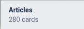

## An epiphany

I have come to realize that I am a bookmark hoarder. I tag and chuck every article that interests me into a Trello
board and these articles are left to rot for eternity as they are never opened again.

Even when I encounter some Quora/StackOverflow post answering my question, I instinctively hit that "Bookmark" button in
Chrome and send it into purgatory. It has come to the point where I don't even know if the bookmarks I have created are
tagged appropriately or they are just chucked into a random category.

Last weekend, I was looking at some self-hosting open-source projects to dabble with for Open-source Deep Dive when I
stumbled upon [Shiori](https://github.com/go-shiori/shiori/) and [Archivy.](https://github.com/archivy/archivy) I
thought to myself, "wouldn't it be cool if I could take all of my bookmarks in Chrome and Trello and archive them for
future reference?" Naively, I exported my Chrome bookmarks and imported them into Shiori, only to realise that I was
archiving the most obscure links ever. And then, I was hit with an epiphany - 

> "Would I even read these links? Or am I changing outfits for the same problem?"

It really did seem like I was just trying to find fancier ways of putting off reading these articles. Even the creator
of Shiori had a similar epiphany. In his issue addressing his departure from the project 
([here](https://github.com/go-shiori/shiori/issues/256)), he stated that one of the reasons why he stopped working on
Shiori was because

> Since long ago, I've got a habit to bookmark everything that looks interesting, even those that I haven't read. 
> Thanks to this, I have a huge amount of backlog of article that I haven't read. To fix this, now I use a private blog
> where I wrote interesting things that I've found from other articles. This way, I'm forced to read the article, 
> because if I didn't read it properly, then I can't convey it in written form properly.

## The light at the end of the tunnel

Reading that has made me realise that I would benefit more from this kind of reflective reading, rather than the
mindless hoarding of these bookmarks. So, what I plan to do is to create a new blog just for these ramblings. Maybe I'll 
post them to a Notion page as a private catalogue and only siphon those that are *really* interesting into my
recommendations list or I can start a new blog project to manage the contents but that is yet to be confirmed.

On top of that, I would like to become more active in writing this year so ideally, I would like to share my reflections
on an article I have read on this main blog every week. Other series like Open-source Deep Dive will still be in motion
but those require a lot more research and careful planning so they will be less frequent! I have also started reading a
lot more technical books so I will be sharing my findings and learnings on those when I get the chance to!

But for now, I would like to correct my bad habit of bookmark hoarding and begin taking more concrete steps towards
becoming a better developer/computer scientist in 2021!

