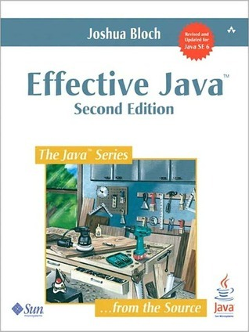
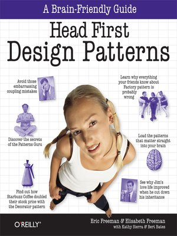
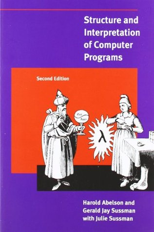

These are a list of the resources that I have found incredibly inspiring or memorable. While most of them are related to
programming, I have shared some of the resources that I have stumbled upon outside of programming. 

## Articles

### Don't serve burnt pizza
    
A common focus of developers when building products is this affixation with trying to cram every possible feature into 
the Minimum Viable Product (MVP). Often, this is a reflection of the developer's obsession with trying to solve all of 
the user's problems so that the MVP launch would make a big splash.

This article, however, emphasises the need to perform proper user research before diving straight into developing a MVP.
Rather, focus on building a Minimum Lovable Product (MLP) which addresses the core of user needs before anything else.
Instead of focusing on making the MVP launch a big splash, focus on having it address the right concerns of the target 
users. In doing so, the product is able to remain oriented towards the core users and their concerns - rather than
becoming an amalgamation of features mishmashed together around hypothetical concerns and problems.

The article also covers ways that one can perform proper user research and I highly recommend it to any developer who
might be struggling with trying to cram many features their first release.

[Link here.](https://firstround.com/review/dont-serve-burnt-pizza-and-other-lessons-in-building-minimum-lovable-products/)

### Building a simple load balancer in Go

Load balancers are a quintessential tool in backend development. The power to distribute network requests among a fleet
of machines to help prevent fires in a data center is crucial in ensuring the survival of our applications. However, as 
much as it is used in development, it is also a mystery to most developers. And it is understandable why. With the 
existence of cloud platforms like AWS introducing tools like Elastic Load Balancer, the barrier for entry to integrating
load balancers into one's application has been simplified by magnitudes.

The article takes a step back and teaches readers how they can implement their own load balancers with Go. Explaining
the commonly used principles for routing requests among connected machines and how requests are forwarded from one
machine to another.

[Link here.](https://kasvith.me/posts/lets-create-a-simple-lb-go/)

### A Git Horror Story: Repository Integrity With Signed Commits

Often, most developers do not think about the security of their commits. Whether or not commits were actually from them 
often comes as an afterthought - if not, never. That was certainly the case for me. It was not until a good friend of
mine shared this article with me that I started to pay more attention to the tools that I have. It cited a scenario 
that - I believe - many developers would not have thought of and goes into ways to show how what we believe as "safe" 
may not always be the case.

This article is a great look into the security of a widely used developer tool - Git - and the precautions we can take 
to defend ourselves against potentially bad situations.

[Link here.](https://mikegerwitz.com/2012/05/a-git-horror-story-repository-integrity-with-signed-commits)

## Books

### Effective Java

To me, Effective Java is a treasure trove of knowledge that applies to not only Java developers but also any developer
using Object-Oriented Programming (OOP). It has given me insight into the various uses of OOP concepts and it has 
changed the way I look at OOP as a paradigm.

[Link here.](https://www.amazon.com/Effective-Java-Joshua-Bloch/dp/0134685997)

### Head First Design Patterns

Head First Design Patterns was my first introduction to the famed Head First series and it was also my first formal
introduction to design patterns. While I had a faint idea and use of patterns like the builder pattern or the observer
pattern, I was never properly "informed" about the other patterns and their uses. I would highly recommend this book to
anyone who's starting out with design patterns and enjoy a hands-on approach to learning. The scenarios used in the 
book help illustrate the points well and it has served as a great reference book for me.

[Link here.](https://www.amazon.com/Head-First-Design-Patterns-Brain-Friendly-ebook/dp/B00AA36RZY)

### Structure and Interpretation of Computer Programs

Seemingly daunting at first, SICP is a terrific introduction to computational thinking. Yes, the exercises will take a 
while for you to understand them, but the time spent on this book is well worth it. Every developer who is looking to
level up their skills and understanding of programming should pick up this book. While the book uses a dialect of Lisp 
called Scheme, it emphasises fundamental problem-solving skills that can be applied with any programming language. Thus,
I recommend doing each exercise in a programming language you are most comfortable with so that you do not feel lost.

[Link here.](https://mitpress.mit.edu/sites/default/files/sicp/index.html)

### The Places I've Cried in Public

As cliche as a it may seem, this book is one of the few fiction books that I have read in the past few years that I have
actually been able to identify with. It has given me the ability to examine my personal relationships in the past. 
Besides that, this book is a tremendous insight into the mind of a victim trapped in an abusive relationship. While this
book is written with young teen girls in mind, I - like many others - have been able to relate to some aspects of it and
it has made me realise how much we neglect our own health - physically and mentally - for the sake of others.

[Link here.](https://www.amazon.com/Places-Ive-Cried-Public-ebook/dp/B07S4HK451)

## Videos

### Get a Taste of Lambdas and Get Addicted to Streams

<iframe class="video" src="https://www.youtube.com/embed/1OpAgZvYXLQ" frameborder="0" allow="accelerometer; autoplay; encrypted-media; gyroscope; picture-in-picture" allowfullscreen></iframe>

Venkat Subramaniam - man, he is such inspiration to me as a developer. This talk was my first formal introduction to the 
idea of lambdas in general. It took me several replays of the video to properly grok the concepts touted in the video 
but when I finally understood them, the rush was exhilarating.

The video touches on the core concepts of lambdas in Java and moves on to showing off ways that Java uses this concept
to create readable code. While the syntax used in this video is Java, lambdas are a universal idea present in many 
modern programming languages. Regardless of which language you come from, you are surely going to learn something about 
the design of lambdas and how they can be utilised to improve code footprint.

### Why Go is Successful

<iframe class="video" src="https://www.youtube.com/embed/k9Zbuuo51go" frameborder="0" allow="accelerometer; autoplay; encrypted-media; gyroscope; picture-in-picture" allowfullscreen></iframe>

At the beginning of my Go journey, I was taken aback by the number of "missing" features the language had compared to 
the languages I used (I came from a JVM background, using Java and Kotlin heavily). Things like a lack of generics 
stumped me as I had grown so accustomed to them. However, the video - by one of the creators of the language, Go - was a
wonderful explanation to why the team behind the language had made so many seemingly odd design choices. Rather than 
focusing on creating a robust language that was jam packed with features, the development team behind Go decided that it
would be more effective for developers to have simplicity first in their language. Trading cool features for solid, 
unwavering conventions, they opted to keep the language as simple as possible, thereby allowing developers to understand
and work on new Go codebases with minimal understanding of the overall codebase - a problem I have encountered with many
other languages.

## Podcasts

### CodeNewbie

Unlike what the name entails, this podcast is suited to developers of all experience levels. Every episode, it 
introduces a new guest who shares their unique take on a certain topic - effectively making us (the listeners) - a code
newbie to a foreign topic. The podcast has shared about topics spanning from compiler design to COBOL. It is the perfect
thing to listen along to on my commutes.

[Link here.](https://www.codenewbie.org/podcast)

### Full Stack Radio

This podcast is a really chill way to spend an hour of your time. The host invites individuals from the forefront of 
web development to share their insights on development. Often, these guests are developers of widely used libraries and
they talk about things like the philosophy behind their libraries or how they have applied techniques to developing 
widely used libraries.

[Link here.](http://www.fullstackradio.com/)
